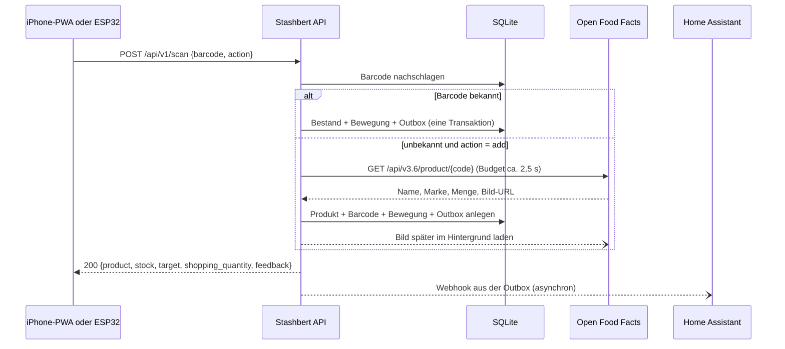
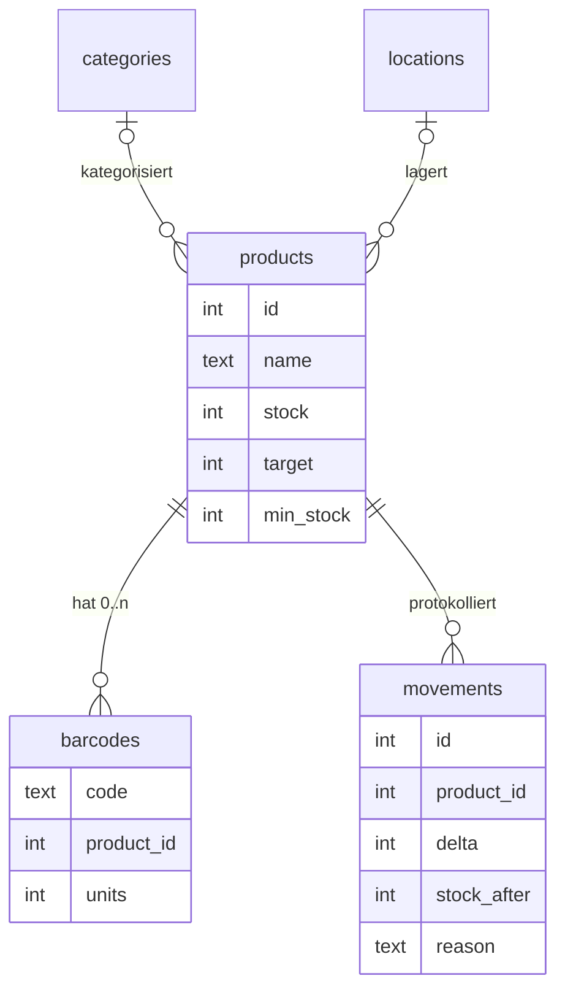

# Stashbert: Architektur und Technologieentscheidungen

| | |
|---|---|
| Stand | 22.09.2026 |
| Status | Entwurf zur Entscheidung, Planungsphase, noch kein Anwendungscode |
| Geltungsbereich | MVP (M1) und die direkt anschließenden Ausbaustufen M2 bis M4 |

**Konventionen in diesem Dokument**

- **Fakt:** recherchiert und mit Quelle belegt, Stand 22.09.2026. Wo eine Quelle nur sekundär ist oder Doku und Quellcode sich widersprechen, steht das dabei.
- **Entscheidung:** Architekturentscheidung mit Begründung. Das ist Bewertung, kein Fakt.
- **Annahme:** bewusst getroffen, aber nicht belegt. Bitte korrigieren, falls falsch.
- **POC-n:** muss vor oder während der Umsetzung auf echter Hardware geprüft werden, siehe [Kapitel 22](#22-poc-liste).

## Inhalt

- [0. Kurzfassung](#0-kurzfassung)
- [1. Requirements Summary](#1-requirements-summary)
- [2. Non-Goals](#2-non-goals)
- [3. Analyse StoreStash](#3-analyse-storestash)
- [4. Frontend-Vergleich](#4-frontend-vergleich)
- [5. Backend-Vergleich](#5-backend-vergleich)
- [6. Datenbank-Vergleich](#6-datenbank-vergleich)
- [7. Barcode-Scanning auf iPhone/PWA](#7-barcode-scanning-auf-iphonepwa)
- [8. Open-Food-Facts-Integration](#8-open-food-facts-integration)
- [9. ESP32-/Hardware-Scanner-Architektur](#9-esp32-hardware-scanner-architektur)
- [10. Home-Assistant-Integration](#10-home-assistant-integration)
- [11. Bring!-Synchronisation](#11-bring-synchronisation)
- [12. Empfohlener Stack](#12-empfohlener-stack)
- [13. Begründung jeder Technologieentscheidung](#13-begründung-jeder-technologieentscheidung)
- [14. Datenmodell](#14-datenmodell)
- [15. API-Design](#15-api-design)
- [16. Deployment mit Docker Compose](#16-deployment-mit-docker-compose)
- [17. Backup-/Restore-Konzept](#17-backup-restore-konzept)
- [18. Security-Modell](#18-security-modell)
- [19. MVP-Scope](#19-mvp-scope)
- [20. Spätere Erweiterungsmöglichkeiten](#20-spätere-erweiterungsmöglichkeiten)
- [21. Implementierungsplan](#21-implementierungsplan)
- [22. POC-Liste](#22-poc-liste)
- [23. Offene Fragen](#23-offene-fragen)
- [Anhang: Quellen](#anhang-quellen)

---

## 0. Kurzfassung

Stashbert ist ein einzelner Container: eine kleine TypeScript-API (Node.js + Hono) mit SQLite, die eine statische Svelte-PWA ausliefert. Gescannt wird im Browser mit einem WebAssembly-Decoder (zxing-wasm), weil Safari auf iOS die native BarcodeDetector-API auch in Version 27 nicht ausliefert. Alle Scanner, also iPhone und später der ESP32, benutzen denselben Endpunkt `POST /api/v1/scan`. Der Server erledigt Produktsuche, Open-Food-Facts-Lookup, Bestandsänderung und Protokoll. Nach außen meldet Stashbert Ereignisse als generische Webhooks. Home Assistant reagiert darauf und überträgt die Einkaufsliste über seine vorhandene Bring!-Integration. Stashbert selbst kennt weder Home Assistant noch Bring!.

### Entscheidungen auf einen Blick

| Bereich | Entscheidung | Wichtigste Alternative |
|---|---|---|
| Frontend | Svelte 5 + Vite, statische SPA/PWA, kein SvelteKit | Preact + Vite, SvelteKit im SPA-Modus |
| Barcode | `barcode-detector` als Ponyfill (zxing-wasm), WASM selbst gehostet | html5-qrcode (im Wartungsmodus) |
| Backend | Node.js 26 LTS + Hono, TypeScript per nativem Type Stripping | Go + net/http + huma |
| Sprache(n) | TypeScript für Frontend, Backend und geteilte Schemas; YAML für ESPHome/HA | Go im Backend, TypeScript im Frontend |
| Datenbank | SQLite (WAL) über `node:sqlite`, reines SQL, eigene kleine Migrationen | PostgreSQL 18 |
| API | REST/JSON unter `/api/v1`, OpenAPI 3.1 aus Zod-Schemas, Fehler nach RFC 9457 | MQTT für Geräte |
| Ereignisse | Transaktionale Outbox in SQLite, generische Webhooks | HA-Events über die HA-REST-API |
| HA-Anbindung | Webhook-Trigger + REST-Sensor, später optional MQTT-Discovery | eigene HA-Integration (HACS) |
| Einkaufsliste | Variante C: Stashbert berechnet, HA überträgt per `todo.*` nach Bring! | Variante A: direkte Bring!-Anbindung |
| Hardware-Scanner | ESPHome, `http_request` auf denselben Scan-Endpunkt | ESPHome über HA-Native-API |
| Deployment | 1 Container, Docker Compose, 1 Volume `/data`, TLS über vorhandenen Reverse Proxy | Postgres + Backend + Frontend + nginx (StoreStash) |

### Architekturdiagramm

```
┌───────────────────────────┐          ┌───────────────────────────┐
│ iPhone: PWA (Svelte)      │          │ ESP32-Scanner (M3)        │
│ Kamera + zxing-wasm       │          │ ESPHome, UART-Scan-Engine │
│ zentraler Scan-Button     │          │ Tasten ADD / CONSUME      │
└─────────────┬─────────────┘          └─────────────┬─────────────┘
              │ HTTPS, Session-Cookie                │ HTTP(S), Bearer-Token
              ▼                                      ▼
┌──────────────────────────────────────────────────────────────────┐
│ Reverse Proxy (vorhanden), TLS-Terminierung                      │
└────────────────────────────────┬─────────────────────────────────┘
                                 ▼
┌──────────────────────────────────────────────────────────────────┐
│ Stashbert: 1 Container (Node.js + Hono, TypeScript)              │
│                                                                  │
│  REST API /api/v1 + OpenAPI      statische SPA + Service Worker  │
│  Domäne: Scan, Bestand, Einkauf  Lookup-Kette mit Cache          │
│  Outbox -> Webhook-Zustellung    Bild-Download im Hintergrund    │
│                                                                  │
│  /data: stashbert.db (SQLite) · images/ · backups/               │
└───────────────┬──────────────────────────────────┬───────────────┘
                │ HTTPS, nur Produkt-Lookup        │ Webhooks (Push)
                ▼                                  ▼
┌───────────────────────────┐          ┌───────────────────────────┐
│ Open Food Facts API v3.6  │          │ Home Assistant            │
│ (+ Schwester-Datenbanken) │          │ Webhook-Trigger           │
└───────────────────────────┘          │ REST-Sensor liest Summary │
                                       └─────────────┬─────────────┘
                                                     │ todo.add_item /
                                                     │ update_item / remove_item
                                                     ▼
                                       ┌───────────────────────────┐
                                       │ Bring!-Integration        │
                                       │ -> Bring!-App             │
                                       └───────────────────────────┘
```

Ablauf eines Scans:



---

## 1. Requirements Summary

### 1.1 Zweck

Stashbert beantwortet für einen Haushalt vier Fragen: Was habe ich? Wie viel davon? Wie viel möchte ich normalerweise haben? Was muss nachgekauft werden? Das Leitbild für die Bedienung: Barcode vor die Kamera oder den Scanner halten, Piepton, erledigt.

### 1.2 Mengengerüst

| Größe | Wert |
|---|---|
| Haushalte | 1 |
| Produkte | 100 bis 1000 |
| Benutzer und Geräte | wenige, etwa 2 bis 5 |
| Scans | Annahme: 10 bis 50 pro Tag, beim ersten Erfassen einmalig einige Hundert |
| Bewegungen pro Jahr | Annahme: unter 20.000 Zeilen |
| Request-Rate | sehr gering, gelegentlich Bursts beim Einräumen |

Folge: Performance ist kein Architekturtreiber. Die Architektur wird von Einfachheit, Bedienbarkeit auf dem iPhone und Betriebsaufwand bestimmt.

### 1.3 Funktionale Anforderungen

| ID | Anforderung | Stufe |
|---|---|---|
| F1 | Produkt mit Name, beliebig vielen Barcodes, Bestand, Sollbestand, optional Mindestbestand, Bild, Kategorie, Lagerort, Marke, Packungsgröße | M1 |
| F2 | Einlagern per Scan: bekannt → +1. Unbekannt → Open Food Facts → Produkt anlegen → +1, ohne Pflichteingabe | M1 |
| F3 | Entnehmen per Scan: -1, so schnell wie möglich | M1 |
| F4 | Vorratsliste mit Suche, Filtern und [-]/[+] je Produkt, Korrektur auf absoluten Wert (Inventur) | M1 |
| F5 | Einkaufsliste automatisch berechnen: fehlende Menge je Produkt | M1 |
| F6 | Letzten Scan rückgängig machen, mehrere gleiche Artikel schnell erfassen | M1 |
| F7 | Zentraler Button öffnet direkt den Scanner, mehrere Scans ohne Zwischen-Tap | M1 |
| F8 | Installation als Home-Screen-Web-App auf dem iPhone | M1 |
| F9 | Backup, Restore und Export | M1 |
| F10 | Ereignisse für externe Systeme (Home Assistant) | M2 |
| F11 | Einkaufsliste in eine externe Liste (Bring!) übertragen, austauschbar | M2 |
| F12 | Geräte-API für einen dummen Hardware-Scanner | M2 (API), M3 (Gerät) |

### 1.4 Nicht-funktionale Anforderungen

| ID | Anforderung | Messbares Ziel (Annahme, im MVP zu bestätigen) |
|---|---|---|
| N1 | Geschwindigkeit | Bekannter Barcode: vom Erkennen bis zur Anzeige „3 → 2" unter 500 ms im WLAN. Scanner danach ohne Tap wieder bereit. |
| N2 | Mobile first, iPhone | Einhändig bedienbar, Touch-Ziele mindestens 44 × 44 pt, fühlt sich wie eine App an. |
| N3 | Unabhängigkeit | Läuft ohne Home Assistant, ohne Bring! und ohne Internet. Internet ist nur für Produkt-Lookups nötig. |
| N4 | Betrieb | Docker Compose, keine Kubernetes-Abhängigkeit, keine Microservices. |
| N5 | Backup trivial | Eine Datenbankdatei plus ein Bilderordner. |
| N6 | Wartbarkeit | Wenige Abhängigkeiten, wenige Konzepte, möglichst eine Sprache. |
| N7 | Sicherheit | LAN first. Fernzugriff optional und vorzugsweise über VPN. |
| N8 | Austauschbarkeit | Bring! lässt sich ohne Codeänderung in Stashbert ersetzen. |

### 1.5 Sollbestand und Mindestbestand: ein Konzept oder zwei?

**Analyse.** In der Lagerhaltung heißen die beiden Werte Meldebestand (Nachbestellpunkt) und Bestellniveau (Auffüllziel). Mit nur einem Sollbestand löst jede einzelne Entnahme einen Einkaufsbedarf aus: Spaghetti mit Soll 5 und Ist 4 stehen sofort mit „1 ×" auf der Liste. Für Produkte, die man in größeren Mengen kauft, erzeugt das Rauschen in Bring!. Mit zwei Werten landet ein Produkt erst auf der Liste, wenn der Mindestbestand unterschritten ist, wird dann aber bis zum Sollbestand aufgefüllt.

**Entscheidung.** Beide Konzepte werden getrennt modelliert, aber der Mindestbestand ist optional und standardmäßig ausgeblendet:

- `target` (Sollbestand): wie viel man normalerweise im Haus haben möchte. `0` bedeutet: nicht nachkaufen, nur zählen.
- `min_stock` (Mindestbestand): optional. Leer bedeutet „gleich Sollbestand".
- Regel: Ein Produkt muss nachgekauft werden, wenn `target > 0` und `stock < (min_stock ?? target)`. Die fehlende Menge ist dann `target - stock`.
- Validierung: `0 ≤ min_stock ≤ target`.

| Produkt | Ist | Soll | Mindest | Auf der Liste? | Menge |
|---|---|---|---|---|---|
| Kidneybohnen | 2 | 5 | (leer = 5) | ja, 2 < 5 | 3 |
| Spaghetti | 6 | 5 | (leer) | nein | 0 |
| Dosentomaten | 0 | 4 | (leer) | ja | 4 |
| Mehl | 2 | 4 | 1 | nein, 2 ≥ 1 | 0 |
| Mehl | 0 | 4 | 1 | ja, 0 < 1 | 4 |

Damit verhält sich Stashbert ohne Zusatzaufwand genau wie im Beispiel aus der Aufgabenstellung. Wer weniger Rauschen will, setzt pro Produkt einen Mindestbestand.

### 1.6 Annahmen

| ID | Annahme |
|---|---|
| A1 | Es gibt bereits einen Reverse Proxy (Traefik, Caddy o. ä.) und eine eigene Domain, oder alternativ Tailscale. |
| A2 | Genutzt wird ein iPhone mit aktuellem iOS (27). Das genaue Modell ist wichtig für POC-1 (Nahfokus bei Pro-Modellen). |
| A3 | Gescannt wird überwiegend zu Hause im WLAN. |
| A4 | Es wird in ganzen Einheiten gezählt (Stück, Dose, Packung). Keine Gewichte, keine angebrochenen Packungen. |
| A5 | Alle Personen im Haushalt haben dieselben Rechte. |
| A6 | Home Assistant läuft, die Bring!-Integration ist eingerichtet oder wird es. |
| A7 | Der Docker-Host ist Linux (amd64 oder arm64). |

---

## 2. Non-Goals

Bewusst nicht Teil von Stashbert, auch nicht später ohne neue Entscheidung:

- Rezepte, Meal Planning, Kalorien und Nährwerttracking. Die Nährwertdaten von Open Food Facts werden nicht übernommen.
- Haushaltsbuch, Preise, Preisvergleich.
- Garantie- und Dokumentenverwaltung.
- Komplexe Lagerverwaltung: Chargen, Umlagerungen, Teilmengen, Mengeneinheiten mit Umrechnung (Gramm, Liter).
- KI-Funktionen, LLMs.
- Benutzerrollen, RBAC, Mandanten, mehrere Haushalte.
- Social Features.
- Native iOS-App.
- Statistik-Dashboards. Die kann Home Assistant aus den Ereignissen bauen.

Nicht im MVP, aber im Datenmodell nicht verbaut (siehe [Kapitel 20](#20-spätere-erweiterungsmöglichkeiten)):

- MHD/Ablaufdaten.
- Offline-Schreiben (Warteschlange auf dem iPhone).
- Rückkanal aus Bring!: Das Abhaken in Bring! ändert keinen Bestand. Der Bestand ändert sich nur beim Einlagern per Scan.
- Mehrsprachige Oberfläche. Das MVP ist deutsch; Code, API und Bezeichner sind englisch.

---

## 3. Analyse StoreStash

Repository: <https://github.com/Thoomaastb/StoreStash>. Der Code wurde am 22.09.2026 geklont und gelesen. Pfadangaben beziehen sich auf das Repository.

### 3.1 Steckbrief (Fakten)

- **Reife:** 5 Sterne, 115 Commits an 7 Tagen zwischen 03.03. und 19.04.2026, ein einziger Maintainer. Seit fünf Monaten nichts mehr auf `main`, nur Dependabot-PRs (14 offen, unter anderem Svelte 4 → 5). Eine Release, `v0.12.0` „First Public Release".
- **Herkunft:** Commit `eac01ce` heißt „StoreStash by Clause.AI" und fügt 73 Dateien mit 3.537 Zeilen auf einmal hinzu. Vier Security-Audit-Dokumente nennen Claude als Auditor. Der Code ist also weitgehend KI-generiert.
- **Umfang:** rund 8.500 Zeilen Anwendungscode (Python 3.094, Svelte 4.008, TypeScript 1.073). Es gibt keine Lockfiles und keine Tests. CI prüft nur den Import und den Build.
- **Stack laut Code:**
  - Frontend: SvelteKit 2.15 mit **Svelte 4** und `adapter-node`. SSR ist aktiv, bringt aber nichts, weil alle Seiten ihre Daten in `onMount` laden.
  - Styling: Tailwind 3.4.
  - Backend: FastAPI 0.115 mit SQLAlchemy 2.0 async und asyncpg, Connection-Pool 10+20, 2 uvicorn-Worker. Datenbank ist PostgreSQL 16.
  - Scanner: html5-qrcode 2.3.8.
- **Alembic ist eingerichtet, aber es gibt 0 Migrationen.** Das Schema entsteht per `create_all` beim Start (`backend/app/main.py:29-30`). Für Schemaänderungen existiert damit kein Upgrade-Pfad.
- **Deployment:** 4 Container (postgres, backend, frontend-Node-Server, nginx). Das Prod-Compose-File verweist auf GHCR-Images, die „unauthorized" liefern (Issue #63).

### 3.2 Datenmodell (Fakten)

- 10 Tabellen, alle mit UUID-Schlüsseln (`backend/app/models/inventory.py`, `models/auth.py`).
- **Genau ein Barcode pro Produkt:** `barcode` ist nullable, indiziert und **nicht eindeutig** (`inventory.py:79`). Mehrere EANs für dasselbe Produkt sind nicht möglich, doppelte Barcodes schon.
- **Nur ein Mindestbestand** (`min_stock_amount`, Float), kein Sollbestand.
- **Bestand als Chargen nach dem Grocy-Modell:** eine Zeile `stock_entries` pro Einkauf mit MHD, Preis und Lagerort. Der Bestand wird in Python als Summe berechnet.
- Mengen sind Floats, Einheiten sind Freitext.

### 3.3 API und Barcode-Workflow (Fakten)

- 40 Endpunkte unter `/api/v1`, aber **kein Scan-Endpunkt**. Der Client ruft Suche, OFF-Proxy, Produkt anlegen und Bestand buchen nacheinander auf. Anlegen und Einlagern sind nicht atomar (`routes/scan/+page.svelte:94-122`).
- **Entnehmen per Scan gibt es nicht.** Die Scan-Seite kann nur einlagern. Entnommen wird über Dashboard-Buttons, jeweils aus einer konkreten Charge.
- **Scanner** (`src/lib/components/ui/BarcodeScanner.svelte`):
  - html5-qrcode ohne Formatbeschränkung, also auch QR-Codes, mit `fps: 10`.
  - **Stop nach jedem Scan**, danach Navigation auf die Produktseite. Für den nächsten Artikel ist ein zusätzlicher Tap nötig.
  - Kein Ton, keine Vibration, keine Kamerawahl, kein Licht.
- **Open Food Facts** (`backend/app/api/v1/barcode.py`):
  - Server-Proxy auf `/api/v2/product/{code}` mit wenigen Feldern und Timeout 8 s.
  - User-Agent `StoreStash/0.8.0 (URL)` ohne Kontakt-Mail, obwohl OFF eine verlangt.
  - Kein Cache, keine Persistenz, kein Fallback. Bilder werden verlinkt, nicht gespeichert.
- **PWA:**
  - Handgeschriebener Service Worker, network-first, `/api` ausgenommen, Cache-Name nie hochgezählt.
  - Die iOS-Meta-Tags sind vorhanden.
  - Kein Hinweis darauf, dass die Kamera HTTPS braucht, obwohl nginx nur Port 80 bedient.

### 3.4 Befunde im Code (Fakten)

- **Rechte nicht durchgesetzt:** RBAC ist geschrieben, wird aber nicht angewendet. `require_role` und `require_permission` sind nirgends in Gebrauch (`core/auth.py:72,94`). Ein Lese-Token kann alles ändern.
- **Paginierung unvollständig:** Das Frontend lädt nur die erste Seite mit 50 Produkten und filtert clientseitig. Ab 51 Produkten sind Liste und „niedriger Bestand" unvollständig.
- **Einstellungen:** Nullable Felder lassen sich per PATCH nicht leeren. `SECRET_KEY` wird nie benutzt, blockiert aber den Start, weshalb die Doku `DEBUG=true` empfiehlt.
- **Einkaufsliste:** Es gibt keine, weder Tabelle noch Endpunkt noch Seite. Auch keine Home-Assistant-, Webhook-, MQTT- oder Bring!-Anbindung; alles steht als „Vision" in der Roadmap.
- **Scope Creep:** 6 Farbthemen, In-App-Changelog, Statistik-Dashboard mit Durchschnittspreisen, Kiosk-Geräte, Docusaurus-Site. Gleichzeitig fehlen die Einkaufsliste und Scan-zum-Entnehmen.

### 3.5 Bewertung: was übernehmen, was nicht

| Thema | StoreStash | Stashbert | Begründung |
|---|---|---|---|
| Frontend-Framework | SvelteKit + adapter-node, SSR an | Svelte 5 + Vite, statische SPA | SSR bringt bei `onMount`-Datenladen nichts und kostet einen Node-Server-Container. |
| Backend | FastAPI, async SQLAlchemy, Pool, 2 Worker | ein Prozess, synchrones SQLite | Bei 1 Haushalt ist Nebenläufigkeit kein Thema. Async-ORM und Pool erzeugen nur Komplexität. |
| Datenbank | PostgreSQL 16 | SQLite | siehe [Kapitel 6](#6-datenbank-vergleich) |
| Migrationen | Alembic ohne Migrationen, `create_all` | nummerierte SQL-Dateien + `PRAGMA user_version` | Werkzeug ohne Nutzung ist schlechter als ein kleines, benutztes. |
| Barcode-Modell | 1 Barcode pro Produkt | Tabelle `barcodes`, 1:n | Kidneybohnen verschiedener Marken sollen einen gemeinsamen Sollbestand haben. |
| Bestandsmodell | Chargen, Float-Mengen | eine Integer-Zahl pro Produkt + Bewegungsprotokoll | Scan → -1 darf keine Chargenauswahl erfordern. |
| Scan-Ablauf | Client orchestriert 3 bis 4 Calls, nur Einlagern | ein atomarer Server-Endpunkt für Einlagern und Entnehmen | ESP32 soll dumm bleiben, PWA und Gerät teilen die Logik. |
| Scanner | html5-qrcode, Stop nach Scan | zxing-wasm, Dauerbetrieb, Sperrzeit pro Code | html5-qrcode ist im Wartungsmodus (siehe 7.2), Stop-nach-Scan verhindert Serienscans. |
| OFF | v2, kein Cache, Bilder verlinkt | v3.6, Cache, Platzhalter + Nachladen, Bilder lokal | v2 ist deprecated, Rate-Limit ist auf 15/min gesunken (siehe 8.1). |
| Auth | Argon2 + Pepper, Sessions, Kiosk, API-Keys, RBAC (nicht durchgesetzt) | Haushaltspasswort + Geräte-Tokens mit Scope | Weniger Code, dafür vollständig durchgesetzt. |
| Deployment | 4 Container | 1 Container | Backup = ein Verzeichnis. |

**Gute Ideen, die übernommen werden:**

- Server-seitiger OFF-Proxy. Er hält die CSP eng und erlaubt einen Cache.
- Manuelle EAN-Eingabe mit Ziffernblock (`inputmode="numeric"`).
- Filter-Chips „niedrig / leer / ok".
- Schnelle [-]-Buttons in der Übersicht.
- Deutsche Standard-Lagerorte als optionale Vorlage.
- Safe-Area-CSS für iOS.

### 3.6 Weitere Referenzprojekte (Fakten, kurz)

- **Grocy** (PHP, SQLite, ein Container, v4.7.1 vom 04.09.2026): das ERP-artige Vorbild, das hier bewusst vermieden wird. Die HA-Integration ist eine HACS-Integration mit Sensoren und Services, ohne `todo`-Plattform. <https://github.com/grocy/grocy>, <https://github.com/custom-components/grocy>
- **Barcode Buddy**:
  - Zusatz zu Grocy für USB-Scanner, mit Lookup-Kette OFF, UPCitemdb, OpenGTINdb und weiteren Quellen. <https://github.com/Forceu/barcodebuddy>
  - Gute Idee: **Modus-Barcodes**. Ein gedruckter Barcode schaltet zwischen Einlagern und Entnehmen um. Das ist nützlich für den ESP32 (siehe 20).
- **Homebox:** Go-Backend und Nuxt-Frontend **in einem Container**, SQLite standardmäßig. Ein Beleg dafür, dass „ein Container + SQLite" auch bei deutlich größeren Projekten trägt. <https://github.com/sysadminsmedia/homebox>
- **KitchenOwl und Mealie:** Einkaufslisten-/Rezept-Apps (Flask bzw. FastAPI), SQLite standardmäßig. Mealie ist in HA Core als `todo` verfügbar.
- **pantry-host** (klein, 2026): empfiehlt Tailscale, um die HTTPS-Pflicht der iPhone-Kamera zu erfüllen. Das deckt sich mit Kapitel 7.6. <https://github.com/jpdevries/pantry-host>

---

## 4. Frontend-Vergleich

### 4.1 Fakten

| Option | Aktuelle Version | Relevante Fakten |
|---|---|---|
| Svelte 5 + Vite | svelte 5.57.1, vite 8.3 | Offiziell über `npm create vite` (Template `svelte-ts`). Für Routing braucht man laut Doku eine Bibliothek oder eigenen Code ([svelte.dev](https://svelte.dev/docs/svelte/getting-started)). |
| SvelteKit (SPA-Modus) | kit 2.70.3 | SPA per `ssr = false` + `adapter-static` mit Fallback-Seite. Die Doku warnt: „SPA mode has a large negative performance impact" ([svelte.dev](https://svelte.dev/docs/kit/single-page-apps)). Eingebauter Service-Worker-Support mit `$service-worker` und automatischer Registrierung ([svelte.dev](https://svelte.dev/docs/kit/service-workers)). **SvelteKit 3 ist in Vorabversion** (3.0.0-next.27 vom 08.09.2026). `@vite-pwa/sveltekit` hatte seit 11/2025 kein Release und deklariert keine Kit-3-Unterstützung. |
| React 19 + Vite | react 19.3.0 | Die React-Doku rät von einem eigenen Vite-Setup ab und empfiehlt ein Framework ([react.dev](https://react.dev/learn/build-a-react-app-from-scratch)). |
| Next.js | next 16.3.6 | Statischer Export (`output: 'export'`) verliert alle serverabhängigen Features: Server Actions, Cookies, Rewrites, ISR, Bildoptimierung ([nextjs.org](https://nextjs.org/docs/app/guides/static-exports)). Kein eingebauter Service Worker, für Offline wird auf Serwist verwiesen ([nextjs.org](https://nextjs.org/docs/app/guides/progressive-web-apps)). |
| Vue 3 + Vite | vue 3.5.43 | Stabile Composition API, Vue 3.6 (Vapor) als RC. |
| Nuxt (SPA-Modus) | nuxt 4.5.2 | `ssr: false` + `nuxt generate` ([nuxt.com](https://nuxt.com/docs/4.x/guide/concepts/rendering)). `@vite-pwa/nuxt` 1.1.1, README nennt noch „Nuxt 3". |
| Preact + Vite | preact 10.29.8 | Preact 11 als RC. React-kompatibel über `preact/compat`. |
| htmx + Alpine | htmx 2.0.11 (npm latest), 4.0.0 auf GitHub | htmx 4 wird laut Projekt 2027 zu `latest`. |
| PWA-Werkzeug | vite-plugin-pwa 1.3.0, Workbox 7.4.1 | Unterstützt Vite 3 bis 8. Workbox bewegt sich langsam. |

Laufzeit-Größe laut [js-framework-benchmark](https://github.com/krausest/js-framework-benchmark), Brotli-komprimiert, Benchmark-App ohne CSS:

| Implementierung | Größe (Brotli) |
|---|---|
| Preact (Hooks) | 5,7 kB |
| Svelte 5 | 9,7 kB |
| Vue 3.5 | 23,3 kB |
| React 19 | 51,4 kB |

Ökosystem (npm-Downloads pro Woche, 15. bis 21.09.2026):

| Paket | Downloads pro Woche |
|---|---|
| react | 132,7 Mio. |
| preact | 24,3 Mio. |
| vue | 12,0 Mio. |
| svelte | 4,2 Mio. |

Zufriedenheit laut State of JS 2025 (Sekundärquelle, nicht direkt verifiziert):

| Framework | Zufriedenheit |
|---|---|
| Svelte | 86 % |
| Vue | 84 % |
| Preact | 81 % |
| React | 72 % |

### 4.2 Beobachtung

Kamera-Zugriff, Barcode-Decoding und das iOS-Verhalten sind **framework-unabhängig**. Sie laufen in einem eigenständigen TypeScript-Modul, egal welches UI-Framework drumherum steht. Die Meta-Frameworks (Next, Nuxt, SvelteKit) lösen vor allem Server-Rendering, Routing und Datenladen auf dem Server. Stashbert braucht davon nichts, weil die API ohnehin ein eigener Server ist und die App hinter einem Login im LAN läuft. Die Frage ist damit: Welche UI-Bibliothek liefert drei bis fünf Ansichten mit dem wenigsten Code und den wenigsten Konzepten?

### 4.3 Bewertungsmatrix

Legende: ++ sehr gut, + gut, o neutral, - schwach. „=" heißt: kein Unterschied zwischen den Optionen.

| Kriterium | Svelte + Vite | SvelteKit SPA | React + Vite | Next.js | Vue + Vite | Nuxt SPA | Preact + Vite | htmx + Alpine |
|---|---|---|---|---|---|---|---|---|
| Entwicklungsaufwand | ++ | + | o | - | + | o | + | + Listen / - Scanner |
| Wartbarkeit | + | o (Kit 3 steht an) | + | - | + | o | + | o |
| PWA | + | ++ | + | - | + | + | + | - |
| iPhone/Safari | = | = | = | = | = | = | = | = |
| Kamera/Barcode | = | = | = | = | = | = | = | - (viel JS neben dem Paradigma) |
| TypeScript | + | + | ++ | ++ | + | + | + | - |
| Größe/Komplexität | ++ | + | - | -- | o | - | ++ | ++ |
| Ökosystem | o | o | ++ | ++ | + | + | + | o |
| Langfristigkeit | + | o | ++ | o | + | o | + | o |

### 4.4 Entscheidung

**Svelte 5 + Vite als statische SPA, ohne SvelteKit.**

- Pro Ansicht ist es am wenigsten Code: Markup, Logik und scoped CSS stehen in einer Datei. Ein CSS-Framework ist nicht nötig.
- Die Laufzeit ist klein (9,7 kB).
- Übergänge und Animationen für das Scan-Feedback sind eingebaut.
- Es gibt kein SSR, keine Load-Funktionen und keine Adapter.
- Das bevorstehende SvelteKit-3-Major betrifft Stashbert nicht.
- Routing: ein minimaler Hash-Router (drei Tabs plus Produktdetail), selbst geschrieben oder als kleine Bibliothek.
- PWA: `vite-plugin-pwa`.

Svelte, Preact und Vue sind hier alle tragfähig. Den Ausschlag gibt der geringste Code-Umfang bei Formularen und Listen. Next.js und Nuxt scheiden aus, weil ihre Kernleistung (Server-Rendering) nicht gebraucht wird. htmx scheidet aus, weil der Scanner ohnehin eine clientseitige App mit Zustand ist.

---

## 5. Backend-Vergleich

### 5.1 Fakten

| Thema | Python / FastAPI | Node.js / TypeScript | Go |
|---|---|---|---|
| Aktuelle Version | FastAPI 0.141.1 (weiterhin 0.x), Pydantic 2.13, Python 3.14 | Node 24 Active LTS (Maintenance ab 20.10.2026), **Node 26 wird am 28.10.2026 LTS** (EOL 30.04.2029) ([nodejs.org](https://nodejs.org/en/about/previous-releases)) | Go 1.27.1, zwei Majors pro Jahr, Go-1-Kompatibilitätsversprechen ([go.dev](https://go.dev/doc/devel/release)) |
| TypeScript/Typen ohne Build | n/a | **Type Stripping stabil seit Node 24.12**, nur „erasable syntax" (keine Enums, keine Parameter-Properties), Imports mit `.ts`-Endung, keine Typprüfung zur Laufzeit ([nodejs.org](https://nodejs.org/api/typescript.html)) | kompiliert |
| SQLite | `sqlite3` in der Stdlib, mit `backup()` | `node:sqlite` eingebaut, **Release Candidate** seit Node 24.15 bzw. 25.7, synchron, mit `backup()` ([nodejs.org](https://nodejs.org/api/sqlite.html)). Alternativ better-sqlite3 13.0.3 mit Prebuilds für glibc und musl, x64 und arm64 im npm-Paket | modernc.org/sqlite v1.59 (pure Go, ohne cgo), mattn/go-sqlite3 (cgo) |
| HTTP/OpenAPI | FastAPI erzeugt OpenAPI automatisch | Hono 4.13 + `@hono/node-server` 2.x, `@hono/zod-openapi` 1.6 (Zod 4) | stdlib-Router mit Methoden und Wildcards seit 1.22 ([go.dev](https://go.dev/blog/routing-enhancements)), huma v2.39 für OpenAPI 3.1 |
| ORM-Lage | SQLAlchemy 2, SQLModel 0.0.46 | Drizzle 1.0 **noch nicht stabil** (0.45.3 latest, 1.0 RC), Kysely 0.29 | sqlc, database/sql |
| Image (komprimiert, amd64) | python:3.14-slim 43,5 MB | node:26-alpine 66,9 MB, distroless nodejs24 55,3 MB | distroless/static 0,9 MB + Binary |
| MQTT-Client | paho-mqtt 2.1 | mqtt.js | paho.golang (MQTT 5) |

### 5.2 Bewertung

| Kriterium | FastAPI / Python | Node.js / TypeScript (Hono) | Go |
|---|---|---|---|
| API-Entwicklung | ++ (Pydantic, Auto-Doku) | + (Zod + zod-openapi) | + (huma) bzw. o (stdlib) |
| Performance | mehr als genug | mehr als genug | mehr als genug |
| Wartbarkeit | o (0.x-Framework, Python-Packaging) | + bei wenigen Abhängigkeiten, - bei npm-Wildwuchs | ++ (stdlib, Kompatibilitätsversprechen) |
| Typsicherheit | o (optional, Pyright/mypy) | + (tsc in CI) | ++ (Compiler) |
| OpenAPI | ++ | + | + |
| Docker | + (klein, aber Interpreter + Pakete) | + | ++ (ein statisches Binary) |
| ESP32/HA | = (alles HTTP/JSON) | = | = |
| Bibliotheken | ++ | ++ | + |
| Langfristige Einfachheit | o | + | ++ |
| Sprachen im Projekt | 2 (Python + TS) | **1** | 2 (Go + TS) |

Zu ESP32 und HA: Das Gerät spricht HTTP/JSON, HA spricht HTTP/JSON bzw. MQTT. Keine der drei Sprachen hat hier einen Vorteil. Eine eigene HA-Integration wäre zwar Python, läge aber ohnehin in einem eigenen Repository und ist nicht geplant (siehe 10.3).

### 5.3 Lohnt sich TypeScript in Frontend und Backend?

Konkret geteilt würde:

1. **Zod-Schemas** für Scan-Request und -Response, Produkt und Ereignis-Envelope. Daraus entstehen die Validierung im Server, die Typen im Client und die OpenAPI-Spezifikation.
2. **GTIN-Normalisierung und Prüfziffer.** Der Client prüft manuelle Eingaben sofort, der Server entscheidet verbindlich.
3. **Einkaufsformel** (`target - stock` bei `stock < min_stock ?? target`) für optimistische Anzeigen im Client.
4. **Werkzeuge:** ein Lockfile, ein Testrunner, eine Formatierung, eine Typprüfung, ein CI-Job, ein Dockerfile.

Die Kosten:

- **npm-Abhängigkeiten altern schneller als Go-Module.** Gegenmaßnahme: Das Backend kommt mit wenigen Laufzeitabhängigkeiten aus (hono, @hono/node-server, zod, @hono/zod-openapi), SQLite ist eingebaut.
- **Node braucht mehr RAM und ein größeres Image als ein Go-Binary.** Auf einem Heimserver ist das irrelevant.

Mit Node 24.12+ fällt außerdem der Build-Schritt fürs Backend weg: Der Server läuft direkt als `.ts`. `tsc --noEmit` prüft die Typen in CI.

### 5.4 Entscheidung

**Node.js (Zielversion 26 LTS, bis 28.10.2026 gleichwertig 24 LTS) + Hono + Zod, TypeScript ohne Build-Schritt im Backend.**

- **Die Entscheidung ist knapp:** Go wäre die richtige Wahl, wenn minimaler Betrieb (ein Binary, 1 MB Basis-Image) wichtiger ist als eine einzige Sprache. An der Architektur ändert sich dadurch nichts: SQLite, REST, SPA im selben Prozess.
- **Kein ORM:** Bei fünf bis sieben Tabellen reichen vorbereitete SQL-Statements in einem Datenmodul. Drizzle ist noch nicht 1.0 und würde das Projekt an dessen Migrationspfad binden.
- **SQLite-Treiber `node:sqlite`:** eingebaut, damit keine native Abhängigkeit und kein Build-Toolchain-Problem im Container. Weil es noch Release Candidate ist, sitzt der Zugriff hinter einem kleinen Datenmodul. Fallback ist better-sqlite3 13 mit derselben synchronen API-Form.

---

## 6. Datenbank-Vergleich

### 6.1 Fakten

**SQLite (3.53.4):**

- **Eignung:** „SQLite does not compete with client/server databases. SQLite competes with fopen()" und „Any site that gets fewer than 100K hits/day should work fine with SQLite" ([sqlite.org/whentouse](https://www.sqlite.org/whentouse.html)).
- **Schreiben:** Es gibt nur einen Schreiber gleichzeitig. Mit WAL laufen Leser und Schreiber parallel. „WAL does not work over a network filesystem" ([sqlite.org/wal](https://www.sqlite.org/wal.html)).
- **Sicheres Online-Backup:** Backup-API, `VACUUM INTO` oder `sqlite3_rsync`. Die Datei im laufenden Betrieb ohne WAL zu kopieren kann korrupte Kopien erzeugen ([sqlite.org/howtocorrupt](https://www.sqlite.org/howtocorrupt.html), [sqlite.org/backup](https://www.sqlite.org/backup.html)).
- **Docker-Volumes:** Auf Docker Desktop (macOS/Windows) gibt es Berichte über Probleme mit Bind-Mounts und WAL (Community-Quellen, nicht offiziell). Auf einem Linux-Host bzw. mit Named Volume ist das kein Thema.
- **Litestream** für kontinuierliche Replikation existiert (v0.5.17, 08/2026), wird hier aber nicht gebraucht.

**PostgreSQL (18.6):**

- **Major-Upgrades brauchen Arbeit:** Ein Major-Upgrade (z. B. 18 → 19) erfordert `pg_dump`/Restore, `pg_upgrade` oder logische Replikation. Das Datenverzeichnis ist zwischen Majors nicht kompatibel ([postgresql.org](https://www.postgresql.org/docs/current/upgrading.html)).
- **Pfadänderung ab Image 18:** Das offizielle Image hat mit 18 den Datenpfad geändert (`/var/lib/postgresql/18/docker`, Volume auf `/var/lib/postgresql`) ([docker-library](https://github.com/docker-library/docs/blob/master/postgres/content.md)).
- **Image-Größe:** postgres:18-alpine ist komprimiert 120 MB groß.

### 6.2 Vergleich

| Kriterium | SQLite | PostgreSQL |
|---|---|---|
| Zusätzliche Container | 0 | 1, mit Healthcheck, `depends_on`, Zugangsdaten |
| Backup | eine Datei per `VACUUM INTO` | `pg_dump` im Container oder Volume-Snapshot im Stillstand |
| Restore | Datei zurücklegen, Container starten | Container mit leerer DB, dann `psql`/`pg_restore` |
| Major-Upgrades | keine; SQLite ist dateiformatstabil | Dump/Restore oder `pg_upgrade` pro Major |
| Nebenläufige Schreiber | einer, bei uns ein Prozess | viele, hier nicht gebraucht |
| Ressourcen | im App-Prozess | eigener Prozess, eigener Speicher |
| Features, die wir brauchen | Transaktionen, Fremdschlüssel, CHECK, JSON-Funktionen, STRICT-Tabellen | alles, und viel mehr |
| Tests | In-Memory-DB pro Test, ohne Docker | Testcontainer oder gemeinsamer Server |

### 6.3 Entscheidung

**SQLite. Ja, PostgreSQL wäre hier unnötige Komplexität.**

Nichts in den Anforderungen braucht einen Datenbankserver: keine Nebenläufigkeit, kein Netzzugriff auf die DB, kein Datenvolumen. PostgreSQL brächte einen zweiten Container, Zugangsdaten, Major-Upgrades und ein weniger triviales Backup.

Konfiguration:

- `journal_mode=WAL`
- `foreign_keys=ON`
- `busy_timeout=5000`
- `synchronous=NORMAL` (im WAL-Modus korruptionssicher, bei Stromausfall geht höchstens die letzte Transaktion verloren)
- STRICT-Tabellen
- Schreibtransaktionen mit `BEGIN IMMEDIATE`
- Eine Verbindung im einzigen Prozess
- Die Datei liegt auf lokalem Datenträger, nie auf NFS/SMB.

Weil nur Standard-SQL ohne ORM-Magie benutzt wird, bleibt ein späterer Umzug auf PostgreSQL möglich. Er ist aber nicht vorgesehen.

---

## 7. Barcode-Scanning auf iPhone/PWA

### 7.1 Fakten: BarcodeDetector

- **Safari (iOS und macOS) liefert die API auch in Safari 27 nicht aus.** Sie steckt hinter dem Feature-Flag „Shape Detection API" mit Status „testable", standardmäßig aus ([MDN BCD](https://github.com/mdn/browser-compat-data/blob/main/api/BarcodeDetector.json), [caniuse](https://caniuse.com/mdn-api_barcodedetector), [WebKit Preferences](https://github.com/WebKit/WebKit/blob/main/Source/WTF/Scripts/Preferences/UnifiedWebPreferences.yaml)).
- **Auf iOS funktioniert sie selbst mit aktiviertem Flag nicht.** WebKit-Bug 281848 „Shape Detection API doesn't work on iOS" ist offen, mit Berichten für 18.x und 26 ([bugs.webkit.org/281848](https://bugs.webkit.org/show_bug.cgi?id=281848)).
- **Chrome auf Android** unterstützt sie seit Version 83 (inklusive EAN-13/8, UPC-A/E). Firefox unterstützt sie nicht.
- **Falle beim Polyfill:** `barcode-detector/polyfill` registriert sich nur, wenn noch keine Implementierung existiert. Auf einem iPhone mit gesetztem Flag bekäme man die kaputte native Klasse. Deshalb muss das **Ponyfill** importiert werden.

### 7.2 Fakten: Bibliotheken

| Bibliothek | Version / letztes Release | Status | Größe (gzip) |
|---|---|---|---|
| html5-qrcode | 2.3.8 / 15.04.2023 | README seit 09/2023: „maintenance mode … not be able to make any bug fixes". Etwa 52 offene Issues zu iOS/iPhone/Safari. Nutzt intern zxing-js. ([GitHub](https://github.com/mebjas/html5-qrcode)) | 108 KB |
| @zxing/library | 0.23.0 / 04.2026 | „Maintenance Mode Only" | 107 KB |
| **zxing-wasm** (Sec-ant) | 3.1.4 / 10.09.2026 | aktiv, zxing-cpp als WebAssembly | Reader-WASM 930 KB (ca. 400 KB gzip) |
| **barcode-detector** (Sec-ant) | 3.2.2 / 16.08.2026 | aktiv, BarcodeDetector-API auf Basis von zxing-wasm | 15 KB + WASM |
| quagga2 | 1.12.1 / 12.2025 | gepflegter Fork, nur 1D | 43 KB |
| STRICH, Scandit, Dynamsoft | kommerziell | ab 99 €/Monat bzw. ab 1.499 $/Jahr | n/a |

- **Das WASM lädt standardmäßig von jsDelivr.** Selbst hosten lässt es sich über `prepareZXingModule` mit `overrides.locateFile`. Version und SHA-256 sind exportiert und können gepinnt werden ([zxing-wasm README](https://github.com/Sec-ant/zxing-wasm#configuring-wasm-serving)).
- **Erkennungsrate:** Ein herstellereigener Benchmark (Dynamsoft, 08/2026) misst für zxing-wasm 78,5 % Erkennung bei EAN-13-Standbildern mit 74 ms Median. Einen unabhängigen Vergleich gibt es nicht; das muss POC-1 auf dem echten Gerät zeigen.

### 7.3 Fakten: Kamera auf iOS

- **Home-Screen-Web-Apps:** `getUserMedia` funktioniert dort seit iOS 13.4 ([Bug 185448](https://bugs.webkit.org/show_bug.cgi?id=185448)).
- **Die Kamera-Freigabe wird in Home-Screen-Web-Apps nicht zuverlässig gespeichert:**
  - Bug 280394 „Persist permissions for getUserMedia" ist offen. Berichte: erneute Abfrage im Standalone-Modus seit etwa 26.3.1; erneute Abfrage nach Bildschirmsperre bei offenem Stream, die sich vermeiden lässt, wenn man vorher die Tracks stoppt ([Bug 280394](https://bugs.webkit.org/show_bug.cgi?id=280394)).
  - Der kommerzielle Anbieter STRICH schreibt im August 2026: „decision to allow camera access is not persisted for PWAs" ([STRICH KB](https://kb.strich.io/article/29-camera-access-issues-in-ios-pwa)).
- **Einstellung:**
  - Global unter Einstellungen > Apps > Safari > Kamera.
  - Pro Website im Safari-Menü unter „Website-Einstellungen".
  - Safari 26.5 hat einen Fehler bei „Erlauben" behoben.
- **Secure Context:** HTTPS oder `localhost` sind Pflicht. LAN-IPs und `.local`-Namen über HTTP gelten **nicht** als sicher ([MDN](https://developer.mozilla.org/en-US/docs/Web/Security/Secure_Contexts)).
- **Mehrere Rückkameras:**
  - Seit iOS 16.3 werden alle Rückkameras aufgelistet.
  - Bei Pro-Modellen ist die Standard-Rückkamera im Nahbereich unscharf. STRICH wählt deshalb „Back Dual Wide Camera".
  - Kamera-Labels sind lokalisiert, Label-Matching ist also fragil.
  - Seit iOS 17 wechselt die virtuelle Kamera selbständig die Linse ([Bug 262416](https://bugs.webkit.org/show_bug.cgi?id=262416)).
- **Constraints:**
  - Unterstützt werden `torch` (Licht) und `zoom`.
  - `focusMode` ist nicht implementiert, `focusDistance` ist nur lesbar ([WebKit IDL](https://github.com/WebKit/WebKit/blob/main/Source/WebCore/Modules/mediastream/MediaTrackCapabilities.idl)).
- **Screen Wake Lock** funktioniert in Home-Screen-Apps seit iOS 18.4 ([WebKit 18.4](https://webkit.org/blog/16574/webkit-features-for-safari-18-4/)).
- **Bekannte Stream-Probleme:**
  - Verliert die App den Fokus, ist der Kamerazugriff weg.
  - Das Kontrollzentrum stoppt den Stream ([Bug 254129](https://bugs.webkit.org/show_bug.cgi?id=254129)).
  - Ein zweiter `getUserMedia`-Aufruf beendet den bestehenden Stream ([Bug 245962](https://bugs.webkit.org/show_bug.cgi?id=245962)).

### 7.4 Fakten: Feedback (Ton, Haptik)

- **Web Audio und Stummschalter:** Web Audio läuft auf iOS in der Kategorie „Ambient" und **folgt dem Stummschalter**. `<audio>`-Elemente ignorieren ihn, unterbrechen aber andere Audiowiedergabe ([Bug 252746](https://bugs.webkit.org/show_bug.cgi?id=252746)).
- **Audio braucht eine Nutzergeste,** um starten zu dürfen.
- **Audio Session API:** `navigator.audioSession.type` gibt es seit Safari 16.4 ([WebKit 16.4](https://webkit.org/blog/13966/webkit-features-in-safari-16-4/)). Dass `"playback"` Web Audio trotz Stummschalter hörbar macht, stammt aus Entwicklerberichten und ist nicht offiziell dokumentiert ([Bug 323022](https://bugs.webkit.org/show_bug.cgi?id=323022)).
- **Vibration:** `navigator.vibrate` unterstützt Safari nicht.
- **Haptik:** Der Trick, über `<input type="checkbox" switch>` programmatisch Haptik auszulösen, **funktioniert seit iOS 26.5 nicht mehr** ([ios-haptics #7](https://github.com/tijnjh/ios-haptics)). Haptik als Scan-Bestätigung ist auf aktuellem iOS nicht erreichbar.

### 7.5 Fakten: PWA auf iOS

- **iOS 26:** „By default, every website added to the Home Screen opens as a web app", ohne Anforderungen an die Installierbarkeit ([WebKit 26.0](https://webkit.org/blog/17333/webkit-features-in-safari-26-0/)).
- **Manifest:**
  - Unterstützt werden `display` (nur `standalone`/`browser`), `name`, `start_url`, `scope`, `theme_color`, `icons`, `id`.
  - Nicht unterstützt werden `orientation`, `shortcuts`, `share_target`, `background_color`.
  - `apple-touch-icon` hat Vorrang vor den Manifest-Icons.
- **Speicher:**
  - Bis zu 60 % der Festplatte pro Origin, Verdrängung nach LRU ([WebKit Storage Policy](https://webkit.org/blog/14403/updates-to-storage-policy/)).
  - Die 7-Tage-Löschregel von ITP gilt für Home-Screen-Apps nicht, sie haben einen eigenen Nutzungszähler ([WebKit](https://webkit.org/blog/10218/full-third-party-cookie-blocking-and-more/)).
- **Hintergrund-APIs:**
  - Background Sync und Periodic Sync werden nicht unterstützt.
  - Web Push gibt es seit iOS 16.4, nur für Home-Screen-Apps.
- **EU/DMA:** Apple hat die Entfernung von Home-Screen-Web-Apps in der EU im März 2024 zurückgenommen.

### 7.6 Fakten: HTTPS im Heimnetz

| Variante | Fakten |
|---|---|
| Eigene Domain + Let's Encrypt DNS-01 + Split-DNS | Keine offenen Ports nötig. Traefik hat DNS-Provider eingebaut, Caddy braucht dafür ein eigenes Build mit DNS-Modul ([caddyserver.com](https://caddyserver.com/docs/automatic-https)). FRITZ!Box-Rebind-Schutz blockiert öffentliche Namen mit privater IP, eine Ausnahme ist nötig ([AVM](https://en.fritz.com/service/knowledge-base/dok/FRITZ-Box-7581-int/663_No-DNS-resolution-of-private-IP-addresses/)). Hostnamen landen in den öffentlichen Certificate-Transparency-Logs. Kein Eingriff am iPhone nötig. |
| Tailscale `serve` | HTTPS auf `<gerät>.<tailnet>.ts.net`, nur im Tailnet erreichbar. Das iPhone muss mit Tailscale verbunden sein ([tailscale.com](https://tailscale.com/kb/1312/serve)). |
| Eigene CA (mkcert, Caddy `tls internal`) | Das Root-Zertifikat muss am iPhone als Profil installiert und manuell voll vertraut werden (Einstellungen > Allgemein > Info > Zertifikatsvertrauenseinstellungen) ([Apple](https://support.apple.com/en-us/102390)). Leaf-Zertifikat höchstens 825 Tage gültig, mit SAN und serverAuth ([Apple](https://support.apple.com/en-us/103769)). Ob Service Worker und Home-Screen-Install damit einwandfrei laufen, ist nicht offiziell dokumentiert. |
| Zertifikatslaufzeiten | Öffentliche Zertifikate: höchstens 200 Tage seit 15.03.2026, 100 Tage ab 2027, 47 Tage ab 2029 ([CA/B Forum SC-081v3](https://cabforum.org/2025/04/11/ballot-sc081v3-introduce-schedule-of-reducing-validity-and-data-reuse-periods/)). Let's Encrypt geht auf 45 Tage ([LE](https://letsencrypt.org/2025/12/02/from-90-to-45)). Automatische Erneuerung ist Pflicht. |

### 7.7 Entscheidungen

**Bibliothek:** Das `barcode-detector`-**Ponyfill** mit zxing-wasm, **immer**, auch dort, wo ein nativer Detector existiert. Das gibt gleiches Verhalten auf allen Geräten und umgeht die kaputte iOS-Implementierung. Das WASM wird selbst gehostet (`locateFile`), per Hash gepinnt und vom Service Worker vorab gecacht. Formate: nur `ean_13`, `ean_8`, `upc_a`, `upc_e`. Das beschleunigt die Erkennung und verhindert Fehltreffer auf QR-Codes. html5-qrcode wird nicht verwendet, weil es im Wartungsmodus ist und iOS-Probleme bekannt sind.

**Kamera-Pipeline (eigenes Modul, framework-unabhängig):**

1. Die Kamera öffnet sich, wenn die Scanner-Ansicht öffnet. Das passiert beim Tap auf den zentralen Button, einer Nutzergeste, die zugleich Audio freischaltet.
2. **Ein Stream bleibt über alle Scans hinweg offen.** Kein Stop nach einem Treffer, kein zweiter `getUserMedia`-Aufruf bei laufendem Stream.
3. Beim Verlassen der Ansicht und bei `visibilitychange → hidden` werden die Tracks gestoppt. Laut Bug 280394 vermeidet das die erneute Abfrage nach der Bildschirmsperre.
4. Dekodiert wird ein horizontaler Streifen in der Bildmitte (Region of Interest), mit 10 bis 15 Versuchen pro Sekunde und höchstens einem gleichzeitigen Decode.
5. Die Kamerawahl beginnt mit `facingMode: environment`. Auf Pro-Modellen wird eine gespeicherte `deviceId` oder `zoom` bevorzugt, wenn POC-1 das nahelegt. Die Wahl ist in einem Einstellungsdialog änderbar.
6. **Licht-Taste** erscheint nur, wenn `getCapabilities().torch` existiert.
7. **Wake Lock** ist aktiv, solange der Scanner offen ist.

**Serienscans:**

- **Sperrzeit gleicher Code:** Nach einem Treffer wird derselbe Code 2 s lang ignoriert (einstellbar).
- **Mehrere gleiche Artikel:** In der Ergebniskarte gibt es einen Button **[+1]**. Drei Dosen Kidneybohnen bedeuten also: scannen, zweimal [+1].
- **Rückgängig:** Die Ergebniskarte hat außerdem **[Rückgängig]**.

**Feedback:**

1. **Visuell (primär):** Vollflächiger Farbblitz. Grün für Einlagern, Blau für Entnehmen, Gelb für Warnung, Rot für Fehler. Dazu große Schrift „Kidneybohnen 3 → 2".
2. **Ton (sekundär):** Kurzer Web-Audio-Ton, unterschiedlich für Einlagern, Entnehmen und Fehler. `navigator.audioSession.type = "playback"` wird gesetzt, sofern vorhanden. Fallback ist ein `<audio>`-Element. Das Verhalten mit Stummschalter und nach App-Wechsel klärt **POC-3**.
3. **Haptik:** gibt es nicht, siehe Fakten.

**Modus:** Ein großer Umschalter „Einlagern | Entnehmen" ist immer sichtbar und farbcodiert. Der zuletzt benutzte Modus wird gemerkt.

**Fallback:** Manuelle EAN-Eingabe mit Ziffernblock. Die Prüfziffer wird sofort im Client geprüft.

**Safari-Tab oder Home-Screen-App:** Beides wird unterstützt. Welche Variante dauerhaft seltener nach der Kamera fragt, entscheidet **POC-2**. Das ist die größte UX-Unsicherheit des gesamten Projekts.

**HTTPS:** Empfohlen ist die eigene (Sub-)Domain mit DNS-01-Zertifikat über den vorhandenen Reverse Proxy und Split-DNS im LAN. Alternative ist Tailscale `serve`. Eine eigene CA ist nur die Notlösung.

**Offline:**

- Der Service Worker cacht App-Shell und WASM vorab. Die App startet damit auch ohne Server.
- Daten gibt es im MVP nur online (im Heimnetz ist der Server erreichbar).
- Die spätere Offline-Warteschlange (IndexedDB) ist über `request_id` in der API vorbereitet. Weil iOS kein Background Sync hat, würde sie beim nächsten App-Start bzw. beim `online`-Ereignis abgearbeitet.

**Pragmatische Alternative ohne Kamera:** Ein Bluetooth-Barcodescanner im Tastaturmodus (HID) am iPhone liefert Hardware-Piepton und Geschwindigkeit. Die PWA empfängt die Ziffern über ein fokussiertes Eingabefeld und ruft denselben Scan-Endpunkt auf. Optional, **POC-7**.

---

## 8. Open-Food-Facts-Integration

### 8.1 Fakten: API

- **Version:**
  - **v3 ist die empfohlene Version (aktuell v3.6), v2 ist seit 01.06.2026 deprecated** ([OFF API-Doku](https://openfoodfacts.github.io/openfoodfacts-server/api/)).
  - Die OpenAPI-Datei im Repository ist veraltet und nennt noch v3.4 ([api-v3.yaml](https://github.com/openfoodfacts/openfoodfacts-server/blob/main/docs/api/ref/api-v3.yaml)).
  - **Die Minor-Version muss im Pfad stehen:** `/api/v3/` liefert ein älteres Schema als `/api/v3.6/`.
- **Endpunkt:** `GET https://world.openfoodfacts.org/api/v3.6/product/{code}?fields=…`.
- **Live-Test vom 22.09.2026:**
  - Gefunden: HTTP 200 mit `status: "success"`.
  - Nicht gefunden: **HTTP 404** mit `result.id: "product_not_found"`.
  - Antwortzeit 0,11 bis 0,34 s.
- **Sprache:**
  - `product_name` ist **immer in der Hauptsprache des Produkts**. Haribo Goldbären liefert „Orsetti D'Oro", weil `lang: it`, auch mit `lc=de`.
  - Der deutsche Name steht nur in `product_name_de`.
  - `lc=de` wählt aber das deutsche Frontbild.
- **Datenqualität:**
  - `quantity` ist Freitext („400 g e"). `product_quantity` und `product_quantity_unit` sind strukturiert.
  - `categories_tags` sind uneinheitlich.
- **User-Agent:** Pflicht im Format `AppName/Version (ContactEmail)`. Für Lesezugriffe ist keine Authentifizierung nötig.
- **Rate-Limit:**
  - **15 Produktabfragen pro Minute und IP** (seit 04/2026, vorher 100) ([PR #13494](https://github.com/openfoodfacts/openfoodfacts-server/pull/13494)).
  - Suche: 10 pro Minute.
  - Beim Überschreiten kommt **HTTP 429 mit HTML-Body**, nicht JSON (live beobachtet).
  - Bei Missbrauch droht ein IP-Bann.
  - Nutzungsregel: „1 API call = 1 real scan by a user".
- **Staging:** `world.openfoodfacts.net` mit Basic Auth `off`/`off`.
- **Lizenzen:**
  - Datenbank ODbL 1.0, Inhalte DbCL 1.0, Bilder CC BY-SA 3.0.
  - Namensnennung „Open Food Facts" mit Link ist Pflicht ([Terms](https://world.openfoodfacts.org/terms-of-use)).
  - Daten aus anderen Datenbanken dürfen **nicht** zu OFF beigetragen werden.
- **Bilder:**
  - URL-Schema: `/images/products/301/762/042/2003/front_de.<rev>.400.jpg`.
  - Live gemessen: **11 bis 23 s bis zum ersten Byte** bei 10 KB, während die API in 0,12 s antwortete.
  - Eine ausdrückliche Hotlinking-Regel wurde nicht gefunden.
- **Nicht-Lebensmittel:**
  - Beauty, Pet Food und Products sind eigene Instanzen.
  - Mit `product_type=all` antwortet OFF mit **302 auf die passende Schwester-Datenbank** (live getestet mit Open Beauty Facts). Ohne den Parameter kommt 404 mit `product_found_with_a_different_product_type`.
- **SDKs:**
  - JS/TS: `@openfoodfacts/openfoodfacts-nodejs`, nur Alpha (2.0.0-alpha.35).
  - Python: `openfoodfacts` 5.3, Standard ist noch v2.
  - Go: v1.0.0 von 2022, nutzt die Legacy-API v0.
- **Bulk-Daten:**
  - JSONL-Export 13 GB komprimiert, CSV 1,28 GB, Parquet 7,9 GB.
  - Delta-Exporte gibt es für 14 Tage, ohne Löschungen.
  - Gesamt 4,77 Mio. Produkte, davon 427.199 mit Land Deutschland.

### 8.2 Fakten: Fallback-Quellen

| Quelle | Zugang | Grenzen | Eignung |
|---|---|---|---|
| OFF-Schwester-Datenbanken | frei, `product_type=all` | wie OFF | gut für Drogerie und Haushaltsartikel |
| UPCitemdb Trial | ohne Key | 100 Anfragen pro Tag | Haribo gefunden, Nutella (FR/DE) nicht. Bilder von Händler-CDNs ohne Lizenz. |
| OpenGTINDB | Query-ID gegen Spende (mind. 35 €), privat höchstens 500 pro Tag mit Verzögerung | Live-Test: 6 s Antwortzeit, Test-ID erschöpft, ISO-8859-1, keine Bilder, keine strukturierte Menge | deutsche Produkte, aber langsam und ohne offene Lizenz |
| EAN-Search.org | kostenpflichtig ab 1 € bzw. 9 € pro Monat | nur Name und Kategorie | nein |
| Barcode Lookup, Go-UPC | kostenpflichtig, Daten nach Vertragsende löschen | Weitergabe verboten | nein |
| Verified by GS1 | 30 Abfragen pro Tag über die Website, API kostenpflichtig | kein freier API-Zugang | nein |

### 8.3 Fakten: GTIN

- **Normalisierung bei OFF:** bis 7 Stellen → auf 8 auffüllen, 9 bis 12 Stellen → auf 13 auffüllen. Die 14-stellige Form mit führender Null ergibt 13 Stellen (live geprüft) ([OFF Normalisierung](https://openfoodfacts.github.io/openfoodfacts-server/api/ref-barcode-normalization/)).
- **UPC-E wird bei OFF nicht expandiert:** UPC-E und UPC-A desselben Artikels sind getrennte Produkte.
- **Prüfziffer:** Modulo 10 mit Gewichten 3/1 von rechts. Führende Nullen ändern sie nicht.
- **Präfixe 02 und 20 bis 29 sind keine GTINs,** sondern Instore-Nummern. Bei GS1 Germany sind 22 bis 29 Nummern mit eingebettetem Preis, Stückzahl oder Gewicht; nur die ersten 7 Stellen identifizieren den Artikel ([GS1 Prefix Summary](https://www.gs1.org/docs/barcodes/SummaryOfGS1MOPrefixes20-29.pdf)).

### 8.4 Entscheidungen

1. **Der Lookup läuft nur im Server.** PWA und ESP32 teilen denselben Weg, einen User-Agent, einen Cache und ein Rate-Limit.
2. **Eigener, minimaler Client** statt SDK (das JS-SDK ist noch Alpha). Anfrage: `GET /api/v3.6/product/{code}?product_type=all&lc=de&fields=code,product_name,product_name_de,generic_name_de,brands,quantity,product_quantity,product_quantity_unit,image_front_url,product_type,lang`. Redirects werden verfolgt. Der User-Agent enthält die Kontaktadresse aus der Konfiguration: `Stashbert/<version> (<mail>)`.
3. **Feldzuordnung:**
   - Name: `product_name_de` vor `product_name` vor `generic_name_de`.
   - Marke: erster Eintrag aus `brands`.
   - Packungsgröße: `quantity` oder `product_quantity` + `product_quantity_unit`.
   - Bild: `image_front_url` (400 px, deutsches Frontbild).
   - OFF-Kategorien werden nicht automatisch übernommen, dafür ist ihre Qualität zu schwankend.
4. **Der Scan wartet nie lange:**
   - Im Scan-Pfad gibt es ein Zeitbudget von ca. 2,5 s.
   - Reicht es nicht (Timeout, 429, 503, kein Internet), legt Stashbert sofort einen **Platzhalter** an: „Neues Produkt 4001234567890" mit `needs_review` und `lookup_state = pending`. Der Bestand wird trotzdem +1 gebucht.
   - Ein Hintergrundjob holt den Lookup nach. Er überschreibt nur Felder, die der Nutzer noch nicht geändert hat.
   - Damit erfüllt Stashbert die Anforderung „Inventory funktioniert ohne OFF", und das 15/min-Limit wird bei der Erstinventur nicht zum Problem.
5. **Rate-Limiter im Server:** Token-Bucket mit höchstens 10 Anfragen pro Minute, also unter dem Limit von 15. Bei 429/503 gibt es exponentielles Backoff.
6. **Cache:**
   - Die Tabelle `lookups` speichert jede Antwort pro Code und Quelle, **auch negative Ergebnisse** (30 Tage).
   - Manuelles „Erneut nachschlagen" ist möglich.
7. **Bilder:**
   - Download **immer im Hintergrund**, nie im Scan-Pfad.
   - Nur von den OFF-Bildhosts (Allowlist), höchstens 2 MB, Content-Type wird geprüft.
   - Ablage unter `/data/images/`, danach wird das Bild aus Stashbert ausgeliefert, nicht verlinkt.
   - In der Produktdetailansicht steht die Namensnennung „Daten und Bild: Open Food Facts, ODbL / CC BY-SA 3.0" mit Link zur Produktseite.
8. **Fallback-Kette als Schnittstelle** (`ProductSource`). Im MVP gibt es nur OFF inklusive Schwester-Datenbanken. Optional und abgeschaltet vorgesehen:
   - UPCitemdb: nur der Name, keine Bilder wegen unklarer Lizenz.
   - OpenGTINDB: mit eigener Query-ID, nur im Hintergrund wegen 6 s Antwortzeit.
   - Kostenpflichtige Dienste werden nicht angebunden.
9. **GTIN-Behandlung:**
   - Normalisiert wird wie bei OFF.
   - Die Prüfziffer wird validiert. Manuelle Eingabe mit falscher Prüfziffer wird abgelehnt.
   - UPC-E wird unverändert gespeichert.
   - Präfixe 20 bis 29 werden nie extern nachgeschlagen, sondern als lokaler Code behandelt. Variable Gewichts- und Preis-Codes (22 bis 29) sind im MVP nicht sinnvoll nutzbar, weil sich der Code je Packung ändert. Erweiterung siehe 20.
10. **Kein lokaler OFF-Spiegel.** 13 GB Export für ein paar Hundert Produkte stehen in keinem Verhältnis.

---

## 9. ESP32-/Hardware-Scanner-Architektur

### 9.1 Fakten (ESPHome 2026.9.0)

- **`http_request`:**
  - Kann `post`/`send` mit Headern (Bearer-Token) und einem JSON-Body per Lambda (auch Zahlen und Booleans).
  - `on_response` liefert `status_code` und mit `capture_response: true` den Body.
  - **`max_response_buffer_size` ist standardmäßig 1 KB.** JSON wird mit `json::parse_json` (ArduinoJson 7.4) geparst ([esphome.io](https://esphome.io/components/http_request/)).
  - Timeout 4,5 s. **Requests laufen blockierend in der Hauptschleife.**
  - `verify_ssl` ist standardmäßig an und prüft auf dem ESP32 mit dem Zertifikats-Bundle von ESP-IDF. Eine eigene CA ist über `ca_certificate_path` möglich.
- **UART:**
  - Es gibt keine eingebaute Komponente „Zeile von UART als Text-Sensor".
  - Dokumentierter Weg ist der UART-Debugger mit `after: delimiter: "\r"` und einer `sequence`-Lambda sowie `dummy_receiver: true` ([esphome.io](https://esphome.io/components/uart/#debugging)).
  - Community-Beispiele für GM65/GM67-Scan-Engines existieren, z. B. [HA-Mealie-Barcode-Scanner](https://github.com/MattFryer/HA-Mealie-Barcode-Scanner) und [barcode-scanner-for-esphome](https://github.com/SmartHome-yourself/barcode-scanner-for-esphome).
- **MQTT:** ESPHome nutzt auf dem ESP32 esp-mqtt ohne Option für die Protokollversion, praktisch also MQTT 3.1.1 (abgeleitet, nicht dokumentiert). Native API und MQTT können parallel laufen.
- **Keine WebSocket-Client-Komponente** in ESPHome.
- **Display:**
  - SSD1306 und ST7789 werden unterstützt.
  - Umlaute brauchen `glyphsets: [GF_Latin_Core]` oder explizite `glyphs`.
  - `rtttl` treibt einen passiven Summer per PWM.
- **Ohne HA-Verbindung:** Hängt ein Gerät nicht an HA, braucht `api:` den Wert `reboot_timeout: 0s`, sonst startet es alle 15 min neu.
- **Umweg über HA:** Über die native API kann ein Gerät HA-Aktionen mit Antwort aufrufen (`homeassistant.action` mit `capture_response`, seit 2025.10). Das setzt die Freigabe „Allow the device to perform Home Assistant actions" voraus ([esphome.io](https://esphome.io/components/api/)).
- **Releases:** ESPHome veröffentlicht monatlich, mit Breaking Changes (z. B. OTA-Passwort → `encryption` in 2026.9).

### 9.2 Protokollvergleich

| Kriterium | REST (`POST /api/v1/scan`) | MQTT | WebSocket | Über HA (native API) |
|---|---|---|---|---|
| Passt zu Anfrage → Antwort → Anzeige | ++ synchron | - Korrelation über Response-Topics, in MQTT 3.1.1 nicht standardisiert | + | + seit 2025.10 |
| ESPHome-Unterstützung | ++ eingebaut | ++ eingebaut | -- keine Komponente | ++ eingebaut |
| Zusätzliche Infrastruktur | keine | Broker | keine | Home Assistant |
| HA-Abhängigkeit | nein | nein (Broker ja) | nein | **ja**, widerspricht N3 |
| Server-Aufwand | vorhanden (PWA nutzt denselben Endpunkt) | MQTT-Client, Topics, Korrelation | Verbindungsverwaltung | HA-Skript + `rest_command` |
| Robustheit | Retry mit `request_id` idempotent | QoS 1, Broker puffert | Reconnect-Logik | abhängig von HA |

### 9.3 Entscheidung

**REST, derselbe Endpunkt `POST /api/v1/scan` wie die PWA.**

- **Warum kein MQTT:** MQTT spielt seine Stärken bei Fan-out und Zustandsverteilung aus. Das ist für Ereignisse an HA später sinnvoll (siehe 10.3), aber nicht für Befehl plus Antwort.
- **Warum kein WebSocket:** ESPHome hat keinen WebSocket-Client.
- **Warum nicht über HA:** Das würde HA zur Laufzeitvoraussetzung für jeden Scan machen.

Damit das Gerät dumm bleibt:

- **Die Antwort enthält alles für die Ausgabe:** `feedback` (`ok`/`warn`/`error`) wird auf ein Tonmuster abgebildet, `message` ist ein fertiger Anzeigetext (z. B. „Kidneybohnen 3→2"). Das Gerät braucht keine Logik außer „Status → Ton, Text → Display".
- **Die Antwort bleibt unter 1 KB** (typisch unter 400 Byte) und passt damit in den Standardpuffer.
- **`request_id` macht Wiederholungen nach Timeouts idempotent.** Wie der ESP32 sie erzeugt (Gerätename + Zähler + Uptime), klärt POC-6.
- **Geräte-Token mit Scope `scan`:** Das Token kann nur scannen, nicht verwalten.

### 9.4 Hardware- und Bedienkonzept (Skizze für M3)

- **Hardware:**
  - ESP32 mit ESP-IDF-Framework.
  - UART-Scan-Engine (GM65/GM861-Klasse, 3,3-V-TTL), per Konfigurations-Barcode auf UART und Auto-Sense-Modus gestellt: Barcode hinhalten, die Engine liest selbstständig.
  - Der Piepton der Engine ist abgeschaltet. Der ESP32 piept erst nach der Server-Antwort, mit unterschiedlichen Mustern für Erfolg, Warnung und Fehler.
- **Tasten:**
  - Die Tasten **ADD** und **CONSUME** wählen den Modus. Standard ist CONSUME, weil Entnehmen am Vorratsschrank der häufigste Fall ist.
  - ADD bleibt aktiv, bis CONSUME gedrückt wird oder 5 Minuten vergangen sind (Einräumen nach dem Einkauf).
  - Eine LED oder das Display zeigt den Modus.
- **Display (optional):** Produktname und „3→2", Umlaute über `GF_Latin_Core`.
- **Unbekannter Barcode:**
  - Bei ADD legt der Server ein Produkt an (OFF oder Platzhalter). Es erscheint in der PWA unter „Prüfen".
  - Bei CONSUME kommt ein Fehlerton mit „Unbekannt".
- **Transport:**
  - Standard ist HTTPS über den Reverse Proxy mit `verify_ssl` (ESP-IDF-Bundle, Let's-Encrypt-Roots).
  - Ist der TLS-Handshake pro Request zu langsam (**POC-6**), gibt es als dokumentierte Ausnahme HTTP direkt auf den Container-Port im IoT-VLAN mit dem `scan`-Token. Das Risiko ist akzeptiert, weil das Token nur scannen darf.
- **HA bleibt optional:** Das Gerät kann zusätzlich per nativer API Entitäten an HA melden (letzter Scan, Modus). Der Datenpfad läuft aber direkt zu Stashbert.

---

## 10. Home-Assistant-Integration

### 10.1 Fakten (Home Assistant 2026.9.3)

- **REST-API:**
  - `POST /api/events/<type>` feuert ein Ereignis, erfordert aber ein **Token eines Admin-Benutzers** (`@require_admin`).
  - Long-Lived-Tokens sind 10 Jahre gültig ([developers.home-assistant.io](https://developers.home-assistant.io/docs/api/rest/), [Quellcode](https://github.com/home-assistant/core/blob/2026.9.3/homeassistant/components/api/__init__.py)).
- **Webhook-Trigger:**
  - Optionen: `webhook_id`, `allowed_methods` (Standard POST und PUT), **`local_only` mit Standard `true`**.
  - Daten stehen in `trigger.json`, `trigger.data` und `trigger.query`.
  - Keine Authentifizierung außer der geheimen ID.
  - **HA antwortet immer mit 200**, auch bei unbekannter ID oder abgelehnten Anfragen ([Doku](https://www.home-assistant.io/docs/automation/trigger/#webhook-trigger), [Quellcode](https://github.com/home-assistant/core/blob/2026.9.3/homeassistant/components/webhook/__init__.py)).
  - Hinter einem Reverse Proxy muss „Trusted proxies" konfiguriert sein.
  - Doku und Quellcode widersprechen sich bei Nabu-Casa-Cloudhooks und `local_only`; hier nicht relevant.
- **Trigger-basierte Template-Sensoren** können per Webhook-Trigger Zustand und Attribute speichern. Beides wird nach einem Neustart wiederhergestellt ([Doku](https://www.home-assistant.io/integrations/template/#trigger-based-template-entities)).
- **REST-Sensor:**
  - Unterstützt `value_template` und `json_attributes`.
  - Ein Zustand darf höchstens 255 Zeichen haben.
  - Attribute über 16 KB schreibt der Recorder nicht in die Datenbank.
  - Der Standard von `scan_interval` beim Top-Level-`rest:` ist laut Quellcode 15 s, laut Doku 30 s; man sollte ihn explizit setzen.
- **`rest_command`:** Unterstützt `response_variable`. Bei 4xx/5xx gibt es nur eine Warnung im Log.
- **MQTT:**
  - Gerätebasierte Discovery unter `<prefix>/device/<id>/config`.
  - Plattformen unter anderem `sensor`, `binary_sensor`, `event`, `button`, `text`, `number`. **Keine `todo`-Plattform.**
  - HA verlangt einen Broker mit MQTT 5 ([Doku](https://www.home-assistant.io/integrations/mqtt/)).
- **Eigene Integration (HACS):**
  - `manifest.json`, Brand-Icons (seit 2026.3 lokal), Config Flow erwartet, `DataUpdateCoordinator` empfohlen.
  - HA gibt 12 Monate Deprecation für Entwickler-APIs. Der Entwickler-Blog hatte 49 Beiträge seit Januar 2026, viele davon Deprecations ([Doku](https://developers.home-assistant.io/docs/deprecating/)).
- **Vorbild Grocy:** HACS-Integration mit Sensoren und Services (`grocy.add_product_to_stock`), Polling alle 30 s, keine `todo`-Plattform.

### 10.2 Optionen

| Option | Richtung | Kopplung | Aufwand Stashbert | Aufwand HA | Bewertung |
|---|---|---|---|---|---|
| REST-Sensor pollt `GET /api/v1/summary` | HA zieht | lose | minimal | wenige Zeilen YAML | gut für Zustände (Anzahl Einkauf, leer), nicht für Einzelereignisse |
| Generische Webhooks an HA-Webhook-Trigger | Stashbert pusht | lose; Stashbert kennt nur eine URL | Outbox + Zustellung | Automationen | **gut für Ereignisse**, auch für andere Empfänger (Node-RED, n8n) |
| HA-Events über `POST /api/events` | Stashbert pusht | eng: Admin-Token von HA in Stashbert | gering | gering | abgelehnt: Admin-Rechte und HA-spezifisch |
| MQTT mit Discovery | Stashbert publiziert | lose über Broker | MQTT-Client, Discovery-Payloads | keiner, Entitäten entstehen automatisch | sehr gut, aber zusätzliche Infrastruktur |
| Eigene HA-Integration | beidseitig | eng, zweites Repo in Python | eigene Codebasis | Installation über HACS | nur bei nachgewiesenem Bedarf |

### 10.3 Entscheidung

- **Stufe 1 (M2): generische Webhooks + REST-Summary + `rest_command`.**
  - Stashbert schreibt jedes Ereignis in eine Outbox-Tabelle, und zwar in derselben Transaktion wie die Bestandsänderung. Ein Hintergrundjob stellt es an alle konfigurierten URLs zu.
  - HA empfängt die Ereignisse über einen Webhook-Trigger mit `local_only: true`.
  - Für Zustände pollt HA `GET /api/v1/summary` als REST-Sensor.
  - Aktionen aus HA heraus, etwa ein Dashboard-Button „Bestand +1", laufen über `rest_command` mit einem Token mit Scope `read`/`full`.
  - Stashbert enthält **keinen HA-spezifischen Code**.
- **Stufe 2 (M4, optional): MQTT-Publisher mit HA-Device-Discovery.**
  - Entitäten: Sensoren „Einkauf: Anzahl", „Leer: Anzahl" und ein `event`-Entity für Scans.
  - Lohnt sich, wenn ohnehin ein Broker läuft. Umgesetzt als zusätzlicher Ausgang der Outbox, nicht als Ersatz.
- **Stufe 3: eigene Integration nur bei echtem Bedarf,** z. B. `todo`-Entity „Stashbert-Einkauf" oder Services mit UI. Der Wartungsaufwand durch die HA-Änderungsrate ist erheblich.

### 10.4 Ereigniskatalog

| Typ | Wann | Wichtige Daten | Beispiel-Automation |
|---|---|---|---|
| `stock.added` | Bestand erhöht (Scan, [+], Rückgängig) | `product`, `delta`, `stock_before`, `stock_after`, `source` | Protokoll, Statistik |
| `stock.consumed` | Bestand verringert | wie oben | „Produkt entnommen" |
| `stock.adjusted` | Inventur/Korrektur auf absoluten Wert | wie oben | |
| `product.empty` | Bestand wechselt von >0 auf 0 | `product` | Push-Nachricht „Dosentomaten leer" |
| `shopping.changed` | fehlende Menge ändert sich | `product`, `missing_before`, `missing_after`, `stock`, `target` | Bring!-Sync (Kapitel 11), „Einkauf erforderlich" |
| `shopping.snapshot` | manuell ausgelöst („Liste neu senden") | `items[]` aller Produkte mit `target > 0`, inkl. `missing = 0` | Abgleich der kompletten Liste |
| `product.created` | Produkt angelegt (Scan oder manuell) | `product`, `origin` (`openfoodfacts`/`manual`/`placeholder`), `needs_review` | Hinweis „neues Produkt prüfen" |

Die Wünsche „Bestand unterschreitet Soll" und „Einkauf erforderlich" entsprechen `shopping.changed` mit `missing_before == 0 und missing_after > 0`. Um HA-Templates einfach zu halten, stehen die Flags `became_needed` und `became_satisfied` zusätzlich in den Daten.

Envelope (für alle Typen gleich):

```json
{
  "id": "5f0c6f1e-8a2b-4a57-9d0e-0d2a3c1b7e44",
  "type": "shopping.changed",
  "occurred_at": "2026-09-22T18:03:11Z",
  "source": "stashbert",
  "data": {
    "product": { "id": 17, "name": "Kidneybohnen", "brand": "Kaufland" },
    "stock": 2,
    "target": 5,
    "missing_before": 2,
    "missing_after": 3,
    "became_needed": false,
    "became_satisfied": false
  }
}
```

### 10.5 Zustellung

- **Konfiguration:** Die Webhook-URLs kommen im MVP aus Umgebungsvariablen (`WEBHOOK_URLS`, kommagetrennt). Jede URL bekommt alle Ereignisse, gefiltert wird in HA über `trigger.json.type`.
- **Wiederholungen:** Nur bei Netzfehlern, Timeout (5 s) und 5xx, mit exponentiellem Backoff bis 24 h. Danach wird das Ereignis verworfen und geloggt.
- **HA meldet keine Fehler:** Weil HA immer 200 antwortet, bleibt eine falsche Webhook-ID unbemerkt. Deshalb gibt es in den Einstellungen „Testereignis senden" und ein Zustellprotokoll.
- **Signatur (später):** Eine HMAC-Signatur nach „Standard Webhooks" ist für andere Empfänger vorgesehen. HA kann sie nicht prüfen, im LAN reicht die geheime Webhook-ID.

### 10.6 Beispielkonfiguration (Skizze, in M2 zu verifizieren)

REST-Sensor für Zustände:

```yaml
rest:
  - resource: https://stashbert.example.org/api/v1/summary
    headers:
      Authorization: !secret stashbert_bearer   # "Bearer <token mit Scope read>"
    scan_interval: 60
    sensor:
      - name: Stashbert Einkauf
        unique_id: stashbert_shopping_count
        value_template: "{{ value_json.shopping_count }}"
        json_attributes:
          - shopping
      - name: Stashbert leer
        unique_id: stashbert_empty_count
        value_template: "{{ value_json.empty_count }}"
```

Benachrichtigung bei leerem Produkt:

```yaml
automation:
  - alias: "Stashbert: Produkt leer"
    triggers:
      - trigger: webhook
        webhook_id: stashbert-<lange-zufällige-id>
        local_only: true
    conditions:
      - "{{ trigger.json.type == 'product.empty' }}"
    actions:
      - action: notify.mobile_app_iphone
        data:
          message: "{{ trigger.json.data.product.name }} ist leer."
```

---

## 11. Bring!-Synchronisation

### 11.1 Fakten

- **Bring!-Integration in HA:**
  - Core-Integration seit 2024.2, `cloud_polling`, Qualitätsstufe Platinum.
  - Abfrage alle 90 s und direkt nach jeder HA-Aktion. Einrichtung mit E-Mail und Passwort ([Doku](https://www.home-assistant.io/integrations/bring/)).
  - Sie erzeugt ein `todo`-Entity pro Liste.
  - Unterstützt werden Anlegen, Ändern, Löschen und die Beschreibung. **`description` wird auf das Bring!-Feld „Spezifikation" abgebildet**, also den Text unter dem Artikelnamen.
- **`todo.add_item`:**
  - Liefert keine UID zurück.
  - HA prüft nicht auf Duplikate.
  - Die Bring!-Integration sendet **bei jedem Aufruf eine neue UUID** ([Quellcode](https://github.com/home-assistant/core/tree/2026.9.3/homeassistant/components/bring)). Laut README der Bibliothek bleiben Einträge mit UUID getrennt. Daraus folgt: **Ein zweites `add_item` mit demselben Namen erzeugt sehr wahrscheinlich einen doppelten Eintrag.** Das ist aus dem Code abgeleitet, nicht live getestet.
- **`todo.update_item`:**
  - Sucht den **ersten** Eintrag, dessen UID oder Name passt, und kann `description` und `status` setzen.
  - Beim Umbenennen ändert Bring! die UID.
- **`todo.remove_item`:** Scheitert, wenn der Eintrag nicht existiert.
- **`todo.get_items`:** Liefert Einträge mit `uid`, `summary`, `status` und `description`. Laut Quellcode sind das ohne `status`-Filter alle Einträge, laut Doku nur offene.
- **Katalognamen:** Die Bibliothek übersetzt Artikelnamen in Bring!-Katalogschlüssel und zurück.
- **Inoffizielle API:** Die Bibliothek `bring-api` ist inoffiziell: „An unofficial python package" ([GitHub](https://github.com/miaucl/bring-api)).
- **Keine öffentliche API:** Eine öffentliche Listen-API von Bring! wurde nicht gefunden. Die Nutzungsbedingungen enthalten keine API-Regel, erlauben Bring! aber den Ausschluss von Nutzern ohne Angabe von Gründen.
- **Bruchstelle im April 2026:** Neue Prospekt-Artikel brachen die Einrichtung ([Issue 167545](https://github.com/home-assistant/core/issues/167545)). Die Community hat das behoben.
- **Direkte Clients ohne HA:**
  - JS: `bring-shopping` 2.0.1 vom 01/2025, seitdem inaktiv, nutzt alte namensbasierte Endpunkte.
  - Go: keine gepflegte Bibliothek.
- **Alternative `todo`-Integrationen mit Beschreibung:** Local To-do, Todoist, Google Tasks, CalDAV, iCloud, AnyList (HACS), KitchenOwl (HACS). Ohne Beschreibung: Shopping List, Mealie, OurGroceries.

### 11.2 Variantenvergleich

| Kriterium | A: Stashbert → Bring! direkt | B: Stashbert → HA → Bring! | C: generische Ereignisse + API, HA integriert |
|---|---|---|---|
| Abhängigkeit von Bring! | hoch: inoffizielle API im eigenen Code | keine im Code, Bring!-Wissen in HA-Automation | keine |
| Bring! ersetzen | Code ändern | Automation ändern | `entity_id` ändern |
| Zugangsdaten | Bring!-Passwort in Stashbert | in HA | in HA |
| Wartung bei API-Änderungen | selbst, ohne gepflegte JS-Bibliothek | HA-Community (Platinum-Integration) | HA-Community |
| Aufwand in Stashbert | Bring!-Client, Mapping, Fehlerbehandlung | HA-spezifischer Aufruf | Outbox + Webhooks, ohnehin für F10 nötig |
| Nutzen für andere Empfänger | keiner | gering | hoch (Node-RED, n8n, eigene Skripte) |

### 11.3 Entscheidung

**Variante C als Architekturprinzip, konkret umgesetzt auf dem Weg von Variante B.**

Stashbert ist die Wahrheit darüber, **was fehlt und wie viel**. Bring! ist nur die Oberfläche zum Einkaufen. Stashbert kennt Bring! nicht und sendet `shopping.changed`. Eine HA-Automation übersetzt das in `todo.*`-Aufrufe auf eine beliebige `todo`-Entität. Variante A wird verworfen: inoffizielle API ohne gepflegte JS-Bibliothek, Zugangsdaten in Stashbert, Wartung bei jeder Bring!-Änderung.

### 11.4 Sync-Semantik

Weil `add_item` bei Bring! vermutlich doppelte Einträge erzeugt, arbeitet die Automation mit **Übergängen** statt „einfach hinzufügen":

| Übergang (`missing_before → missing_after`) | Aktion in HA |
|---|---|
| 0 → n | `todo.add_item(item: Name, description: "n Stück")` |
| n → m, m > 0 | `todo.update_item(item: Name, description: "m Stück", status: needs_action)` |
| n → 0 | `todo.remove_item(item: Name)`, Fehler bei fehlendem Eintrag ist harmlos |

Konsequenzen und Randfälle:

- **Abhaken in Bring!:** Der Eintrag wandert in Bring! auf „Zuletzt verwendet" und bleibt als erledigter Eintrag in HA sichtbar. Stashbert erfährt davon nichts. Sobald eingescannt wird, geht die fehlende Menge auf 0 und der Eintrag wird entfernt.
- **Teilweise eingekauft** (3 fehlen, 2 gekauft und eingescannt): Der Übergang ist 3 → 1. `update_item` setzt „1 Stück" und `status: needs_action`, der Artikel ist in Bring! wieder offen. Das ist gewollt.
- **Gekauft, aber noch nicht eingescannt:** Der Artikel ist in Bring! abgehakt und in Stashbert noch fehlend. Diese Lücke ist akzeptiert; sie schließt sich beim Einräumen.
- **Von Hand gelöschte Einträge:** `update_item` scheitert. Für eine robuste Variante prüft die Automation vorher per `todo.get_items`, ob der Name existiert. Das wird in POC-5 festgelegt.
- **Name:** Übertragen wird der Produktname aus Stashbert. Er sollte generisch sein („Kidneybohnen", nicht „Kidney Bohnen rot 400g Marke X"). Die Marke steht in einem eigenen Feld.
- **Abgleich:** Die Aktion „Liste neu senden" erzeugt `shopping.snapshot` mit allen Produkten mit `target > 0`, inklusive `missing = 0`. Die HA-Automation fasst nur Einträge an, deren Namen Stashbert-Produkten entsprechen; von Hand angelegte Familieneinträge bleiben unberührt.
- **Listen ohne Beschreibungsfeld:** Bei Shopping List, Mealie oder OurGroceries steht die Menge im Namen („3 × Kidneybohnen"). Mengenänderungen werden dann zu Entfernen + Hinzufügen.
- **Brücke im MVP:** Die Einkaufsansicht hat „Als Text teilen" über das iOS-Teilen-Menü (z. B. in Notizen oder Nachrichten). Ob Bring! geteilten Text als Artikel übernimmt, ist nicht geprüft.

Skizze der Automation (**POC-5** bestätigt das Verhalten gegen die echte Bring!-Liste):

```yaml
automation:
  - alias: "Stashbert: Einkauf nach Bring!"
    mode: queued
    triggers:
      - trigger: webhook
        webhook_id: stashbert-<lange-zufällige-id>
        local_only: true
    conditions:
      - "{{ trigger.json.type == 'shopping.changed' }}"
    variables:
      liste: todo.bring_einkauf
      d: "{{ trigger.json.data }}"
    actions:
      - choose:
          - conditions: "{{ d.missing_before == 0 and d.missing_after > 0 }}"
            sequence:
              - action: todo.add_item
                target: { entity_id: "{{ liste }}" }
                data: { item: "{{ d.product.name }}", description: "{{ d.missing_after }} Stück" }
          - conditions: "{{ d.missing_before > 0 and d.missing_after > 0 }}"
            sequence:
              - action: todo.update_item
                target: { entity_id: "{{ liste }}" }
                data: { item: "{{ d.product.name }}", description: "{{ d.missing_after }} Stück", status: needs_action }
          - conditions: "{{ d.missing_before > 0 and d.missing_after == 0 }}"
            sequence:
              - action: todo.remove_item
                target: { entity_id: "{{ liste }}" }
                data: { item: "{{ d.product.name }}" }
```

---

## 12. Empfohlener Stack

| Bereich | Entscheidung |
|---|---|
| **Frontend** | Svelte 5 + Vite, statische SPA, minimaler Hash-Router |
| **UI-Stil** | Svelte-scoped CSS + CSS-Variablen, kein CSS-Framework |
| **PWA** | `vite-plugin-pwa` (Manifest + Precache inkl. WASM), `apple-touch-icon` |
| **Barcode Library** | `barcode-detector` (Ponyfill) auf zxing-wasm, WASM selbst gehostet und gepinnt |
| **Backend** | Node.js 26 LTS (bis 28.10.2026: 24 LTS) + Hono 4 + `@hono/node-server` |
| **Sprache(n)** | TypeScript überall (Frontend, Backend, `shared/`); YAML für ESPHome und HA |
| **Validierung/OpenAPI** | Zod 4 + `@hono/zod-openapi`, OpenAPI 3.1 unter `/api/v1/openapi.json` |
| **Datenbank** | SQLite über `node:sqlite` (Fallback better-sqlite3), WAL, STRICT |
| **DB-Zugriff** | vorbereitete SQL-Statements in einem Datenmodul, kein ORM |
| **Migrationen** | nummerierte `.sql`-Dateien + `PRAGMA user_version`, beim Start, vorher automatisches Backup |
| **API** | REST/JSON, `/api/v1`, RFC 9457 Problem Details, Idempotenz über `request_id` |
| **Ereignisse** | Outbox-Tabelle + generische Webhooks; später optional MQTT |
| **HA-Anbindung** | Webhook-Trigger + REST-Sensor + `rest_command`; kein HA-Code in Stashbert |
| **Einkaufsliste** | berechnet in Stashbert, Übertragung nach Bring! über HA `todo.*` |
| **Hardware-Scanner** | ESPHome, `http_request` → `POST /api/v1/scan`, Token mit Scope `scan` |
| **Auth** | Haushaltspasswort (scrypt aus `node:crypto`), signiertes Session-Cookie; API-Tokens mit Scopes |
| **Deployment** | ein Container, Docker Compose, Volume `/data`, TLS am vorhandenen Reverse Proxy |
| **Backup** | täglich `VACUUM INTO` nach `/data/backups`, JSON-Export, Host-Backup sichert `/data` |
| **Tests** | Vitest für `shared/` und Server (In-Memory-SQLite), wenige Playwright-Smoke-Tests später |
| **Qualität** | `tsc --noEmit`, `svelte-check`, Prettier; GitHub Actions baut ein Multi-Arch-Image (amd64/arm64) |

Hinweis zur Werkzeugkette: Auf npm ist TypeScript 7 inzwischen `latest`. Welche Version `svelte-check` unterstützt, wird beim Aufsetzen des Repositories geprüft.

---

## 13. Begründung jeder Technologieentscheidung

Jede Entscheidung mit Begründung, wichtigster Alternative, Grund gegen die Alternative und Auslöser für eine Neubewertung.

### 13.1 Frontend: Svelte 5 + Vite

- **Warum:** Am wenigsten Code pro Ansicht (Markup, Logik und scoped CSS in einer Datei), kleine Laufzeit (9,7 kB), eingebaute Übergänge für das Scan-Feedback, keine Server-Konzepte.
- **Alternative:** Preact + Vite (5,7 kB, React-Wissen übertragbar) bzw. SvelteKit im SPA-Modus.
- **Warum nicht:**
  - Preact braucht für Styling und Formulare mehr eigene Konventionen, ist sonst aber gleichwertig.
  - SvelteKit bringt Routing- und Load-Konzepte mit, die eine reine SPA nicht braucht, und steht vor einem Major-Wechsel (3.0 in Vorabversion).
- **Neu bewerten, wenn:** die App deutlich mehr als 10 Ansichten bekommt oder serverseitiges Rendering nötig wird.

### 13.2 Barcode: `barcode-detector`-Ponyfill auf zxing-wasm

- **Warum:** Aktiv gepflegt (Releases im August/September 2026), zxing-cpp-Qualität als WASM, standardisierte BarcodeDetector-API. Selbst hostbar und damit offline- und LAN-fähig. Umgeht den nativen iOS-Detector, der nicht ausgeliefert und kaputt ist.
- **Alternative:** html5-qrcode (die Wahl von StoreStash).
- **Warum nicht:** Seit 2023 im Wartungsmodus ohne Bugfixes, nutzt das ebenfalls nur noch gewartete zxing-js, viele offene iOS-Issues, und es stoppt nach jedem Scan.
- **Neu bewerten, wenn:** POC-1 schlechte Erkennungsraten zeigt (dann quagga2 für 1D oder eine kommerzielle Engine) oder Safari BarcodeDetector funktionsfähig ausliefert.

### 13.3 PWA-Werkzeug: vite-plugin-pwa

- **Warum:** Erzeugt Manifest und Precache-Liste mit Hashes aus dem Vite-Build und cacht damit das WASM zuverlässig vor. Weit verbreitet (3,4 Mio. Downloads pro Woche).
- **Alternative:** handgeschriebener Service Worker, etwa 50 Zeilen.
- **Warum nicht:** Die Precache-Liste mit Hashes müsste selbst gepflegt werden; genau dort liegt der typische Fehler (bei StoreStash wurde der Cache-Name nie hochgezählt).
- **Neu bewerten, wenn:** das Plugin nicht mehr gepflegt wird. Workbox bewegt sich bereits langsam.

### 13.4 UI-Stil: scoped CSS statt Tailwind

- **Warum:** Svelte kapselt CSS pro Komponente. Ein Dutzend CSS-Variablen reicht für Farben, Abstände und Modusfarben. Eine Abhängigkeit und ein Build-Schritt weniger.
- **Alternative:** Tailwind 4.
- **Warum nicht:** Kein Mehrwert bei drei bis fünf Ansichten. Wer Tailwind bevorzugt, kann es ohne Architekturfolgen ergänzen.

### 13.5 Backend-Sprache und Runtime: TypeScript auf Node.js 26 LTS

- **Warum:** Eine Sprache für alles. Geteilte Zod-Schemas erzeugen Validierung, Client-Typen und OpenAPI. GTIN-Logik und Einkaufsformel werden geteilt. Ein Toolchain, ein Lockfile. Native Type Stripping (stabil seit 24.12) spart den Build-Schritt; `node:sqlite` spart die native Abhängigkeit.
- **Alternative:** Go (1.27) mit stdlib-Router, huma und modernc.org/sqlite.
- **Warum nicht:** Go wäre im Betrieb noch schlanker (statisches Binary, 1-MB-Basis-Image) und langfristig stabiler. Der Preis wären eine zweite Sprache und doppelte oder generierte Typen. Bei dieser Last hat Go keinen Vorteil, der das aufwiegt. Die Entscheidung ist bewusst knapp.
- **Neu bewerten, wenn:** die npm-Abhängigkeiten des Backends über etwa 10 Pakete wachsen oder Node-Upgrades wiederholt Aufwand verursachen.

### 13.6 HTTP-Framework: Hono

- **Warum:** Klein, Web-Standard-Request/Response, erstklassige Zod-/OpenAPI-Integration. Läuft auch unter Bun oder Deno, hält die Runtime also austauschbar. `serveStatic` für die SPA.
- **Alternative:** Fastify 5.
- **Warum nicht:** Ebenfalls sehr gut, aber mit eigenem Plugin-System und JSON-Schema-Welt. Für eine Handvoll Routen reicht Hono vollständig.

### 13.7 Datenbank: SQLite

- **Warum:** Kein zusätzlicher Container, das Backup ist eine Datei, keine Major-Upgrades, In-Memory-Tests. Laut sqlite.org genau der vorgesehene Einsatzfall.
- **Alternative:** PostgreSQL 18.
- **Warum nicht:** Mehr Betrieb (Container, Zugangsdaten, `pg_dump`, Major-Upgrade-Prozedur) ohne Nutzen bei einem Schreiber und 1000 Datensätzen.
- **Neu bewerten, wenn:** mehrere Stashbert-Instanzen auf dieselbe DB zugreifen sollen. Das ist nicht geplant.

### 13.8 DB-Zugriff: SQL ohne ORM, `node:sqlite`

- **Warum:** Fünf bis sieben Tabellen, einfache Abfragen. SQL bleibt lesbar und portabel. `node:sqlite` ist eingebaut und hat `backup()`.
- **Alternative:** Drizzle ORM bzw. better-sqlite3.
- **Warum nicht:** Drizzle ist noch nicht 1.0 und bringt einen eigenen Migrationspfad mit. better-sqlite3 ist die Rückfalloption, falls `node:sqlite` (Release Candidate) Probleme macht. Der Wechsel betrifft nur das Datenmodul.

### 13.9 API: REST/JSON mit OpenAPI

- **Warum:** Der Scan ist Anfrage und Antwort; REST bildet das direkt ab. ESPHome und HA sprechen es ohne Zusatzkomponenten. OpenAPI dokumentiert den Vertrag für Gerät und HA.
- **Alternative:** MQTT als Geräteprotokoll.
- **Warum nicht:** Anfrage/Antwort über MQTT 3.1.1 ist nicht standardisiert und braucht einen Broker als Voraussetzung. MQTT kommt später für Ereignisse, nicht für Befehle.

### 13.10 Ereignisse und HA-Anbindung: Outbox + generische Webhooks

- **Warum:** Kein HA-Code und keine HA-Zugangsdaten in Stashbert. Die Webhooks funktionieren auch für Node-RED oder n8n. Die Outbox garantiert, dass kein Ereignis verloren geht, das zu einer gespeicherten Bestandsänderung gehört.
- **Alternative:** MQTT mit HA-Discovery.
- **Warum nicht zuerst:** Setzt einen Broker voraus und bringt mehr Code (Discovery-Payloads, Retain-Regeln). Als optionale Stufe 2 bleibt es vorgesehen.

### 13.11 Bring!: über HA statt direkt

- **Warum:** Bring! hat keine offizielle API. HA pflegt die Integration (Platinum) samt inoffizieller Bibliothek. Stashbert bleibt frei von Bring!-Wissen, und ein Wechsel der Liste ist eine Zeile YAML.
- **Alternative:** direkte Anbindung (Variante A).
- **Warum nicht:** Siehe 11.2. Der einzige JS-Client ist seit Anfang 2025 inaktiv.

### 13.12 Hardware-Scanner: ESPHome + REST

- **Warum:** ESPHome ist vorhanden, bietet OTA und bringt `http_request` samt TLS mit. Derselbe Endpunkt wie die PWA bedeutet null zusätzliche Serverlogik.
- **Alternative:** ESPHome über die native API mit HA als Vermittler.
- **Warum nicht:** Das macht HA zur Voraussetzung für jeden Scan, was Anforderung N3 widerspricht.

### 13.13 Deployment: ein Container, Docker Compose

- **Warum:** Ein Prozess liefert API und SPA aus. Ein Volume enthält den kompletten Zustand. Updates heißen: Image-Tag ändern und `docker compose up -d`.
- **Alternative:** getrennte Container für Frontend (nginx) und Backend.
- **Warum nicht:** Die statischen Dateien sind wenige Hundert KB. Ein zweiter Container bringt dafür nur Konfiguration.

### 13.14 HTTPS: vorhandener Reverse Proxy mit eigener Domain

- **Warum:** Kein Eingriff am iPhone. Öffentlich vertrautes Zertifikat, das auch der ESP32 mit dem Standard-Bundle prüfen kann. Automatische Erneuerung, was angesichts sinkender Laufzeiten wichtig ist.
- **Alternative:** Tailscale `serve`.
- **Warum nicht als Standard:** Erfordert eine aktive Tailscale-Verbindung auf dem iPhone und einen Tailscale-Client im Heimnetz. Als Option für Fernzugriff ideal.

### 13.15 Auth: Haushaltspasswort + Tokens

- **Warum:** Schützt vor Gästen und IoT-Geräten im WLAN. Ohne Abhängigkeiten (scrypt und HMAC aus `node:crypto`). Tokens mit Scope für Gerät und HA.
- **Alternative:** Forward-Auth über Authelia/Authentik am Proxy.
- **Warum nicht:** Session-Abläufe und Redirects in einer Home-Screen-Web-App sind fehleranfällig, und der ESP32 bräuchte ohnehin Tokens. Wer Forward-Auth betreibt, kann sie zusätzlich vorschalten.

---

## 14. Datenmodell

### 14.1 Überblick



`lookups` (Cache), `outbox` und `api_tokens` haben keine Fremdschlüssel zu Produkten und fehlen deshalb im Diagramm.

### 14.2 Tabellen

**`products`** (M1)

| Spalte | Typ | Regel | Zweck |
|---|---|---|---|
| `id` | INTEGER PK | | intern, auch in der API |
| `name` | TEXT | NOT NULL | generischer Name („Kidneybohnen") |
| `brand` | TEXT | NULL | Marke |
| `package_size` | TEXT | NULL | z. B. „400 g", nur Information |
| `stock` | INTEGER | NOT NULL, ≥ 0 | aktueller Bestand in Einheiten |
| `target` | INTEGER | NOT NULL, ≥ 0, Standard 0 | Sollbestand; 0 = nicht nachkaufen |
| `min_stock` | INTEGER | NULL, 0 ≤ `min_stock` ≤ `target` | Mindestbestand; NULL = wie Soll |
| `category_id` | INTEGER | FK, NULL, ON DELETE SET NULL | optional |
| `location_id` | INTEGER | FK, NULL, ON DELETE SET NULL | optional |
| `image_path` | TEXT | NULL | relativ zu `/data/images` |
| `origin` | TEXT | `openfoodfacts`, `openbeautyfacts`, …, `manual`, `placeholder` | Herkunft, für Namensnennung |
| `lookup_state` | TEXT | `none`, `pending`, `done`, `not_found`, `failed` | für das Nachladen im Hintergrund |
| `needs_review` | INTEGER | 0/1 | automatisch angelegt, Name prüfen |
| `user_edited_fields` | TEXT (JSON) | Liste | schützt Nutzeränderungen beim Nachladen |
| `note` | TEXT | NULL | Freitext |
| `created_at`, `updated_at` | TEXT | ISO 8601 UTC | |

**`barcodes`** (M1)

| Spalte | Typ | Regel | Zweck |
|---|---|---|---|
| `code` | TEXT PK | normalisiert (8, 12/13 oder 14 Stellen, siehe 8.3) | ein Code gehört genau einem Produkt |
| `product_id` | INTEGER | FK, NOT NULL, ON DELETE CASCADE | |
| `units` | INTEGER | NOT NULL, ≥ 1, Standard 1 | Einheiten pro Scan (Multipack, Kiste) |
| `created_at` | TEXT | | |

**`categories`, `locations`** (M1): `id`, `name` (UNIQUE), `sort_order`.

**`movements`** (M1, nur anhängen)

| Spalte | Typ | Regel | Zweck |
|---|---|---|---|
| `id` | INTEGER PK | | |
| `product_id` | INTEGER | FK, ON DELETE CASCADE | |
| `delta` | INTEGER | ≠ 0 | +n / -n |
| `stock_after` | INTEGER | ≥ 0 | für Anzeige und Prüfung |
| `reason` | TEXT | `add`, `consume`, `adjust`, `undo`, `merge` | |
| `source` | TEXT | `pwa`, `device:<name>`, `api`, `ha` | wer hat gebucht |
| `barcode` | TEXT | NULL | gescannter Code |
| `request_id` | TEXT | UNIQUE, NULL | Idempotenz |
| `undoes_id` | INTEGER | FK auf `movements`, NULL, UNIQUE | Rückgängig verweist auf das Original |
| `created_at` | TEXT | | |

**`lookups`** (M1, Cache): `code`, `source`, `found` (0/1), `payload` (JSON), `fetched_at`; PK (`code`, `source`).

**`outbox`** (M2): `id`, `type`, `payload` (JSON), `created_at`, `attempts`, `next_attempt_at`, `delivered_at`, `last_error`.

**`api_tokens`** (M2): `id`, `name`, `token_hash` (SHA-256), `scope` (`scan`, `read`, `full`), `created_at`, `last_used_at`.

### 14.3 Regeln und Designentscheidungen

- **Bestand als Zahl am Produkt, nicht aus Bewegungen berechnet.** Das ist einfach und schnell. `movements` dient als Protokoll, und daraus lässt sich der Bestand zur Kontrolle nachrechnen. Jede Änderung schreibt Produkt, Bewegung und (ab M2) Outbox **in einer Transaktion**.
- **Einkaufsbedarf ist abgeleitet,** er wird nicht gespeichert: `missing = (target > 0 and stock < coalesce(min_stock, target)) ? target - stock : 0`. Bei 1000 Produkten ist das in Mikrosekunden berechnet.
- **Barcodes 1:n.** Kidneybohnen von zwei Marken sind **ein** Produkt mit zwei Codes. Das Zusammenführen (`merge`) verschiebt Barcodes und Bestand und löscht das Quellprodukt.
- **Keine Chargen, keine Floats, keine Einheiten.** Das hält den Scan bei genau einer Zahl.
- **Bestand nie negativ:** Entnehmen bei 0 bleibt bei 0 und liefert eine Warnung. Das ist ein Hinweis auf eine Inventur-Abweichung, kein Fehler.
- **Rückgängig** ist eine Gegenbuchung, kein Löschen. Das Protokoll bleibt vollständig.
- **Nebenläufiges Anlegen:** Zwei gleichzeitige Scans eines unbekannten Codes schützt der Primärschlüssel `barcodes.code`. Der zweite Versuch liest das frisch angelegte Produkt und bucht darauf.
- **Suche:** Die Oberfläche lädt alle Produkte einmal (1000 × ca. 200 Byte) und filtert lokal mit deutscher Groß-/Kleinschreibung. SQLites `LIKE`/`lower()` behandeln Umlaute nicht korrekt, und FTS ist bei dieser Größe unnötig.
- **MHD später:** Das wird eine zusätzliche Tabelle (z. B. `best_before` pro Produkt und Datum mit Menge), ohne das Bestandsmodell zu ändern.

---

## 15. API-Design

### 15.1 Grundsätze

- REST/JSON unter `/api/v1`. Ein Breaking Change bedeutet `/api/v2`, damit ESP32-Firmware nicht bricht.
- **OpenAPI 3.1** wird aus den Zod-Schemas erzeugt und unter `/api/v1/openapi.json` ausgeliefert.
- **Fehler** nach RFC 9457 (`application/problem+json`) mit stabilem Feld `code` (z. B. `unknown_barcode`).
- **Auth:** Session-Cookie (PWA) oder `Authorization: Bearer <token>` (Gerät, HA).
- **Idempotenz:** optionales `request_id` (UUID oder Geräte-ID + Zähler) bei allen bestandsändernden Aufrufen. Eine Wiederholung liefert das ursprüngliche Ergebnis.
- **Keine Paginierung** für Produkte (höchstens ca. 1000). `limit` gibt es nur beim Protokoll.
- **Ändernde Aufrufe** verlangen `Content-Type: application/json` (Teil des CSRF-Schutzes).

### 15.2 Endpunkte

| Methode | Pfad | Zweck | Scope | Stufe |
|---|---|---|---|---|
| POST | `/api/v1/scan` | Einlagern/Entnehmen per Barcode | `scan` | M1 |
| GET | `/api/v1/products` | alle Produkte inkl. `missing`, Filter `needed`, `empty`, `review` | `read` | M1 |
| POST | `/api/v1/products` | Produkt manuell anlegen | `full` | M1 |
| GET/PATCH/DELETE | `/api/v1/products/{id}` | lesen, ändern, löschen | `read`/`full` | M1 |
| POST | `/api/v1/products/{id}/stock` | `{delta}` für [-]/[+] oder `{set}` für Inventur | `full` | M1 |
| POST | `/api/v1/products/{id}/barcodes` | weiteren Barcode zuordnen (`units` optional) | `full` | M1 |
| DELETE | `/api/v1/barcodes/{code}` | Barcode entfernen | `full` | M1 |
| POST | `/api/v1/products/{id}/merge` | `{into}`: Produkt in ein anderes überführen | `full` | M1 |
| POST | `/api/v1/products/{id}/lookup` | erneut bei OFF nachschlagen | `full` | M1 |
| GET | `/api/v1/lookup/{code}` | Vorschau aus OFF ohne Anlegen | `read` | M1 |
| GET | `/api/v1/shopping-list` | berechnete Einkaufsliste | `read` | M1 |
| GET | `/api/v1/movements` | Protokoll (`product_id`, `limit`) | `read` | M1 |
| POST | `/api/v1/movements/{id}/undo` | Buchung rückgängig machen | `scan` | M1 |
| GET/POST/PATCH/DELETE | `/api/v1/categories`, `/api/v1/locations` | Stammdaten | `read`/`full` | M1 |
| GET | `/api/v1/summary` | Kennzahlen für HA-REST-Sensor | `read` | M1 |
| GET | `/api/v1/export` | vollständiger JSON-Export | `full` | M1 |
| POST | `/api/v1/auth/setup`, `/login`, `/logout`; GET `/me` | Erstpasswort, Anmeldung | öffentlich/Session | M1 |
| GET | `/api/v1/health` | Healthcheck | öffentlich | M1 |
| POST | `/api/v1/shopping-list/snapshot` | `shopping.snapshot` auslösen | `full` | M2 |
| POST | `/api/v1/webhooks/test` | Testereignis senden | `full` | M2 |
| GET/POST/DELETE | `/api/v1/tokens` | Geräte- und HA-Tokens verwalten | Session | M2 |

### 15.3 Scan-Vertrag

Anfrage:

```http
POST /api/v1/scan
Authorization: Bearer <token>        (Gerät) oder Session-Cookie (PWA)
Content-Type: application/json

{
  "barcode": "4001234567890",
  "action": "consume",
  "quantity": 1,
  "request_id": "esp-kueche-000482"
}
```

`action` ist `add` oder `consume`. `quantity` ist optional (Standard 1) und wird mit `barcodes.units` multipliziert.

Antwort `200 OK`:

```json
{
  "result": "updated",
  "product": { "id": 17, "name": "Kidneybohnen", "brand": "Kaufland", "image_url": "/images/17.jpg", "needs_review": false },
  "stock_before": 3,
  "stock": 2,
  "target": 5,
  "shopping_quantity": 3,
  "movement_id": 912,
  "feedback": "ok",
  "message": "Kidneybohnen 3→2",
  "warnings": []
}
```

Verhaltensmatrix:

| Fall | HTTP | `result` | `feedback` | Wirkung |
|---|---|---|---|---|
| bekannt, `add` | 200 | `updated` | `ok` | Bestand + `quantity × units` |
| bekannt, `consume`, Bestand > 0 | 200 | `updated` | `ok` | Bestand - `quantity × units`, nicht unter 0 |
| bekannt, `consume`, Bestand = 0 | 200 | `unchanged` | `warn` | nichts; `warnings: ["already_empty"]` |
| unbekannt, `add`, OFF-Treffer | 200 | `created` | `ok` | Produkt aus OFF, Bestand 1, Bild im Hintergrund |
| unbekannt, `add`, kein Treffer oder OFF nicht erreichbar | 200 | `created` | `warn` | Platzhalter, `needs_review`, ggf. Nachladen; `warnings: ["placeholder"]` |
| unbekannt, `consume` | 404 | n/a | `error` | Problem Details `unknown_barcode` |
| ungültiger Code (Prüfziffer, Länge) | 422 | n/a | `error` | Problem Details `invalid_barcode` |
| Wiederholung mit gleicher `request_id` | 200 | wie zuvor | wie zuvor | keine zweite Buchung |
| fehlende/falsche Auth, falscher Scope | 401/403 | n/a | `error` | |

Auch Fehlerantworten enthalten `feedback` und `message`, damit das Gerät ohne Fallunterscheidung ausgeben kann:

```json
{ "type": "about:blank", "title": "Unknown barcode", "status": 404, "code": "unknown_barcode", "feedback": "error", "message": "Unbekannt 4001234567890" }
```

### 15.4 Summary für Home Assistant

```json
{
  "product_count": 143,
  "empty_count": 2,
  "shopping_count": 5,
  "shopping": [ { "id": 17, "name": "Kidneybohnen", "missing": 3 }, { "id": 23, "name": "Dosentomaten", "missing": 4 } ],
  "review_count": 1,
  "updated_at": "2026-09-22T18:03:11Z"
}
```

Die Werte sind klein genug für einen HA-Zustand (höchstens 255 Zeichen) bzw. für Attribute unter 16 KB.

---

## 16. Deployment mit Docker Compose

### 16.1 Container

- **Mehrstufiger Build:**
  1. Stage „web": `npm ci`, Vite-Build der SPA.
  2. Stage „runtime": `node:26-alpine` mit Server-Quellen (`.ts`, laufen per Type Stripping), Produktionsabhängigkeiten und SPA-Build.
  - Keine nativen Module (dank `node:sqlite`), daher auch `gcr.io/distroless/nodejs` möglich.
- **Laufzeit-Härtung:** Non-root-Benutzer, schreibgeschütztes Root-Dateisystem, beschreibbar ist nur `/data`. Healthcheck auf `/api/v1/health`.
- **Port:** 8080 im Container. Veröffentlicht wird er nur für den Reverse Proxy (gemeinsames Docker-Netz) bzw. auf `127.0.0.1`.
- **Image:** Multi-Arch (amd64 und arm64) per GitHub Actions nach GHCR (privat, Pull mit Token). Alternativ `docker compose build` direkt auf dem Server aus dem Git-Checkout.
- **Migrationen** laufen beim Start. Vorher legt Stashbert automatisch ein Backup an (`pre-migration-<version>.db`).

### 16.2 Compose-Skizze

```yaml
services:
  stashbert:
    image: ghcr.io/schmitz-chris/stashbert:0.1.0
    restart: unless-stopped
    read_only: true
    environment:
      TZ: Europe/Berlin
      PUBLIC_URL: https://stashbert.example.org
      OFF_CONTACT: stashbert@example.org       # Kontakt für den OFF-User-Agent
      # WEBHOOK_URLS: http://homeassistant.lan:8123/api/webhook/stashbert-<id>   (M2)
    volumes:
      - ./data:/data                           # Linux-Host; auf Docker Desktop Named Volume verwenden
    networks: [proxy]                          # gemeinsames Netz mit dem Reverse Proxy
    healthcheck:
      test: ["CMD", "wget", "-qO-", "http://127.0.0.1:8080/api/v1/health"]
      interval: 30s
networks:
  proxy:
    external: true
```

### 16.3 Konfiguration

| Variable | Standard | Zweck |
|---|---|---|
| `PORT` | 8080 | HTTP-Port im Container |
| `DATA_DIR` | `/data` | Datenbank, Bilder, Backups, Session-Schlüssel |
| `PUBLIC_URL` | (leer) | für absolute Links und Cookie-Einstellungen |
| `OFF_CONTACT` | (Pflicht für Lookups) | Kontakt im OFF-User-Agent |
| `LOOKUP_SOURCES` | `openfoodfacts` | Fallback-Kette, z. B. `openfoodfacts,upcitemdb` |
| `WEBHOOK_URLS` | (leer) | kommagetrennte Webhook-Ziele (M2) |
| `BACKUP_KEEP_DAYS` | 14 | Aufbewahrung der täglichen Backups |
| `LOG_LEVEL` | `info` | |

Das Haushaltspasswort steht **nicht** in der Konfiguration. Beim ersten Start zeigt die App eine Einrichtungsseite.

### 16.4 Reverse Proxy

- **Aufgaben des Proxys:** TLS-Terminierung für `stashbert.<domain>`, Weiterleitung an `stashbert:8080`, `X-Forwarded-For`/`-Proto` setzen, HSTS.
- **Zertifikat:** DNS-01, damit keine Ports offen sein müssen. Im LAN löst ein lokaler DNS-Eintrag den Namen auf die Server-IP auf (Split-DNS; bei FRITZ!Box Rebind-Ausnahme).
- **Geräte-Port (optional):** Für den ESP32 kann ein zweiter, nur im IoT-VLAN erreichbarer Port direkt auf den Container zeigen (siehe 9.4).

---

## 17. Backup-/Restore-Konzept

### 17.1 Was ist Zustand?

| Pfad | Inhalt | Sichern? |
|---|---|---|
| `/data/stashbert.db` (+ `-wal`, `-shm`) | alle Daten | **nicht direkt kopieren**, stattdessen die Backups |
| `/data/backups/*.db` | konsistente Kopien | ja |
| `/data/images/` | Produktbilder | ja (lassen sich notfalls bei OFF neu laden) |
| `/data/secret` | Schlüssel für Session-Cookies | optional; ohne ihn müssen sich alle neu anmelden |

### 17.2 Mechanismus

- **Täglich** (und vor jeder Migration) führt Stashbert `VACUUM INTO '/data/backups/stashbert-YYYY-MM-DD.db'` aus. Das ergibt eine konsistente, kompakte Kopie im laufenden Betrieb. Aufbewahrung 14 Tage.
- **Manuell** gibt es in den Einstellungen „Backup jetzt" und „Export (JSON)".
- **Offsite:** Das vorhandene Host-Backup (restic, borg o. ä.) sichert `/data/backups` und `/data/images`. Stashbert selbst lädt nichts in die Cloud.
- **Export:** `GET /api/v1/export` liefert Produkte, Barcodes, Kategorien, Lagerorte und Bewegungen als JSON. Das ist menschenlesbar und dient der Migration. Import kommt später.
- **Litestream** ist nicht nötig. Wer es will, kann es als Sidecar ergänzen.

### 17.3 Restore

1. `docker compose stop stashbert`
2. `stashbert.db`, `stashbert.db-wal` und `stashbert.db-shm` in `/data` löschen bzw. beiseitelegen.
3. Gewünschtes Backup nach `/data/stashbert.db` kopieren.
4. Optional `images/` aus dem Host-Backup zurückspielen.
5. `docker compose start stashbert`. Liegt das Backup auf einem älteren Schemastand, läuft die Migration beim Start automatisch.

Ein automatisierter Test in CI prüft den Ablauf: Backup erzeugen, in eine frische Instanz zurückspielen, Inhalte vergleichen. Das ist Abnahmekriterium AK6.

---

## 18. Security-Modell

### 18.1 Schutzziele und Rahmen

- **Schutzgut:** Die Daten sind wenig sensibel (Vorräte), aber die Integrität zählt (falsche Bestände, Spam in Bring!).
- **Hauptrisiken:** Gäste und unsichere IoT-Geräte im WLAN, ein verlorenes iPhone, versehentliche Freigabe ins Internet.
- **Nicht im Scope:** Angreifer mit Root auf dem Docker-Host.

### 18.2 Bedrohungen und Maßnahmen

| Bedrohung | Maßnahme |
|---|---|
| Unbefugter Zugriff aus dem LAN | Haushaltspasswort; alle Endpunkte außer `health` und `setup` erfordern Session oder Token |
| Passwort-Raten | scrypt-Hash; Login-Rate-Limit im Prozess (ein Prozess, daher ausreichend) |
| Gestohlenes Session-Cookie | `HttpOnly`, `Secure`, `SameSite=Lax`; Passwortänderung macht alle Sessions ungültig (Passwort-Version im signierten Cookie) |
| CSRF | `SameSite=Lax`, ändernde Aufrufe nur mit JSON-Content-Type, Prüfung des `Origin`-Headers |
| XSS über Produktnamen aus OFF | Svelte escaped standardmäßig; kein `{@html}` mit Fremddaten; strenge CSP |
| Kompromittiertes Gerät (ESP32) | Token mit Scope `scan` (nur Scan und Rückgängig); einzeln widerrufbar; `last_used_at` sichtbar |
| Abhören im LAN | HTTPS für PWA und HA; HTTP nur als dokumentierte Ausnahme für das Gerät im IoT-VLAN |
| SSRF über Bild-URLs | Download nur von OFF-Bild-Hosts (Allowlist), Größen- und Typprüfung |
| Webhook-Spoofing gegen HA | lange zufällige Webhook-ID, `local_only: true`, Webhooks nie öffentlich |
| Datenverlust | tägliche Backups, Backup vor Migration, Restore-Test in CI |
| Lieferkette (npm) | Lockfile, wenige Abhängigkeiten, Dependabot, `npm ci` im Build |

### 18.3 Authentifizierung

- **Menschen:** Ein Haushaltspasswort, beim ersten Start gesetzt. Danach gibt es ein signiertes Session-Cookie (HMAC mit Schlüssel aus `/data/secret`), das 1 Jahr gilt und sich bei Nutzung verlängert. Keine Benutzerkonten, keine Rollen.
- **Maschinen (M2):**
  - Tokens mit Name und Scope: `scan` für Scan und Rückgängig, `read` für Lesen, `full` für alles außer der Token-Verwaltung.
  - Ein Token wird einmal angezeigt und als SHA-256-Hash gespeichert.
  - Das ESPHome-Token liegt in `secrets.yaml`.

### 18.4 Content Security Policy

`default-src 'self'; img-src 'self' data: blob:; media-src 'self' blob:; connect-src 'self'; script-src 'self' 'wasm-unsafe-eval'; style-src 'self' 'unsafe-inline'; frame-ancestors 'none'`.

- `wasm-unsafe-eval` ist für WebAssembly mit CSP nötig. Ob Safari 27 genau diese Kombination akzeptiert, prüft POC-1.
- `style-src 'unsafe-inline'` ist nur nötig, falls Svelte-Übergänge Inline-Styles setzen. Beim Aufsetzen prüfen und möglichst entfernen.

### 18.5 Fernzugriff

- **Empfohlen: VPN** (Tailscale oder WireGuard). Stashbert ist dann nie öffentlich erreichbar, und die PWA funktioniert unterwegs wie zu Hause.
- **Falls doch öffentlich:**
  - Nur über den Reverse Proxy mit TLS.
  - Optional Forward-Auth (Authelia/Authentik) vorschalten, zusätzlich CrowdSec/fail2ban am Proxy.
  - Der Geräte-Port bleibt intern.
  - HA-Webhooks bleiben `local_only`.
- **Datenschutz:** Außer den OFF-Lookups (die den gescannten Barcode an OFF senden) verlässt nichts das Heimnetz. Keine Telemetrie.

---

## 19. MVP-Scope

### 19.1 Im MVP (M1)

| Bereich | Inhalt |
|---|---|
| Produkte | anlegen, bearbeiten, löschen; mehrere Barcodes; Soll und optional Mindestbestand; Kategorie, Lagerort; Bild aus OFF; zusammenführen |
| Scanner | zentraler Button, Dauer-Scan, Modus Einlagern/Entnehmen, Feedback (Farbe + Ton), [+1], [Rückgängig], manuelle Eingabe, Licht (falls verfügbar), Wake Lock |
| Unbekannte Produkte | automatisch aus OFF anlegen, ohne Pflichteingabe; Platzhalter + Nachladen im Hintergrund; Karte „Neu" mit Schnellauswahl für den Sollbestand ([0] [1] [2] [3] [5] [10]) |
| Vorrat | Liste mit Suche, Filtern (Alle, Nachkaufen, Leer, Prüfen, Ohne Soll), [-]/[+], Inventur-Korrektur |
| Einkauf | berechnete Liste „3 × Kidneybohnen", „Als Text teilen" |
| PWA | Manifest, Icons, Service Worker (App-Shell + WASM), iOS-Meta-Tags, Safe Areas |
| Sicherheit | Haushaltspasswort, Session-Cookie, CSP |
| Betrieb | ein Container, Compose, Migrationen, tägliches Backup, JSON-Export, Healthcheck, Doku für HTTPS |
| API | alle M1-Endpunkte aus 15.2 inkl. `/scan` und `/summary`, OpenAPI |

### 19.2 Nicht im MVP

- **M2:** Outbox/Webhooks, HA-Beispiele, Bring!-Sync, API-Tokens.
- **M3:** ESP32.
- **M4:** MQTT, Offline-Warteschlange, MHD, Foto-Aufnahme für Produkte ohne OFF-Bild, Fallback-Quellen, Import.

### 19.3 Abnahmekriterien

| ID | Kriterium |
|---|---|
| AK1 | Bekanntes Produkt im Entnehmen-Modus: vom Erkennen bis zur Anzeige „3 → 2" unter 500 ms (WLAN, 95. Perzentil), danach ohne Tap scanbereit. |
| AK2 | 10 verschiedene bekannte Produkte nacheinander in unter 30 s, ohne Tap zwischen den Scans. |
| AK3 | Unbekanntes Produkt mit OFF-Treffer: 0 Pflichteingaben; Name, Marke und Menge gesetzt; das Bild erscheint nachträglich. |
| AK4 | Ohne Internet: Scan eines unbekannten Produkts legt einen Platzhalter an, Bestand +1, sichtbar unter „Prüfen"; nach Wiederherstellung der Verbindung wird es automatisch ergänzt. |
| AK5 | Soll 5, Ist 2 ergibt auf der Einkaufsseite „3 × Kidneybohnen". Mit Mindestbestand 1 und Ist 2 erscheint das Produkt nicht. |
| AK6 | Ein Backup lässt sich in eine frische Instanz zurückspielen, alle Daten sind vorhanden (automatisierter Test). |
| AK7 | Installation als Home-Screen-App auf iOS 27, Start im Standalone-Modus, Scanner über den zentralen Button. |
| AK8 | Derselbe Code innerhalb von 2 s wird nur einmal gebucht; [+1] erhöht korrekt; [Rückgängig] stellt den vorherigen Bestand her. |
| AK9 | Dieselbe `request_id` zweimal gesendet ergibt eine Buchung. |

---

## 20. Spätere Erweiterungsmöglichkeiten

| Erweiterung | Andockpunkt | Bemerkung |
|---|---|---|
| ESP32-Scanner | `/api/v1/scan`, Tokens | geplant als M3, siehe Kapitel 9 |
| MQTT mit HA-Discovery | zusätzlicher Outbox-Ausgang | native HA-Entitäten ohne YAML |
| MHD/Ablaufdaten | eigene Tabelle | Einlagern fragt optional nach dem Datum; Ereignis `product.expiring` |
| Offline-Warteschlange | IndexedDB + `request_id` | Abarbeitung beim App-Start, da kein Background Sync auf iOS |
| Modus-Barcodes | Scan-Pipeline | gedruckte Codes „Einlagern" / „Entnehmen", Idee von Barcode Buddy; nützlich für ESP32 ohne Tasten |
| Eigene Etiketten | `barcodes` | QR-/Code-128-Etiketten für Unverpacktes, Eingemachtes, Tiefkühlware |
| Variable Gewichts-/Preis-Codes (22 bis 29) | GTIN-Normalisierung | Zuordnung über die ersten 7 Stellen |
| Fallback-Quellen | `ProductSource` | UPCitemdb, OpenGTINDB (opt-in) |
| Foto aufnehmen | Produkt-Detail | `<input capture>` + Verkleinerung im Browser, kein Server-Bildcode |
| Beiträge zu OFF | Produkt-Detail | fehlende Produkte melden (OFF-Konto nötig), nie Fremddaten |
| Rückkanal aus Bring! | HA-Trigger `todo.item_completed` → Stashbert-API | Status „im Einkaufswagen", kein Bestandseffekt |
| Mehrere Listen | Kategorie → Ziel-Liste | z. B. Drogerie und Supermarkt getrennt, gelöst in der HA-Automation |
| Web Push ohne HA | Service Worker | iOS 16.4+ für Home-Screen-Apps |
| Verbrauchsprognose | `movements` | einfache Durchschnitte („reicht noch ca. 3 Wochen"), keine KI |
| Eigene HA-Integration | API + Ereignisse | nur bei nachgewiesenem Bedarf |
| Import aus Grocy/CSV | Export-Format | für Umsteiger |

---

## 21. Implementierungsplan

### 21.1 Repository-Struktur (Vorschlag)

```
stashbert/
├── docs/                    Architektur, POC-Protokolle, HA-Beispiele
├── shared/                  Zod-Schemas, GTIN, Einkaufsformel (von Web und Server importiert)
├── server/
│   ├── api/                 Hono-Routen
│   ├── domain/              Scan, Bestand, Einkauf, Merge
│   ├── db/                  Datenmodul, migrations/*.sql
│   ├── lookup/              OFF-Client, Rate-Limiter, Hintergrund-Nachladen, Bilder
│   └── events/              Outbox, Webhook-Zustellung (M2)
├── web/
│   ├── src/views/           Vorrat, Scanner, Einkauf, Produkt, Einstellungen
│   ├── src/lib/scanner/     Kamera, Decoder, Feedback (framework-unabhängig)
│   └── public/              Icons, Töne
├── hardware/esphome/        (M3)
├── Dockerfile
├── compose.yaml
├── package.json             ein Paket, ein Lockfile
└── tsconfig.json            erasableSyntaxOnly, verbatimModuleSyntax, allowImportingTsExtensions
```

Bewusst **ein** `package.json` statt eines Monorepos mit Workspaces: `shared/` wird über relative Pfade importiert. Das umgeht auch die Einschränkung, dass Node kein Type Stripping in `node_modules` macht.

### 21.2 Phasen

**Phase 0: POCs (vor dem eigentlichen Code, ca. 2 bis 3 Abende)**

| Schritt | Ergebnis |
|---|---|
| 0.1 | HTTPS-Zugang im LAN einrichten (POC-4) |
| 0.2 | Wegwerf-Scannerseite mit zxing-wasm, Kamerawahl, Ton; auf dem iPhone als Tab und Home-Screen-App testen (POC-1 bis POC-3) |
| 0.3 | Ergebnisse in `docs/poc/` festhalten, Entscheidungen in diesem Dokument ggf. anpassen |

**Phase 1: MVP (M1)**

| Nr. | Aufgabe | Abnahme |
|---|---|---|
| 1.1 | Repo-Skelett: package.json, tsconfig, Vitest, Prettier, `svelte-check`, GitHub Actions (Typprüfung + Tests) | CI grün auf leerem Projekt |
| 1.2 | `shared/`: GTIN-Normalisierung, Prüfziffer, Einkaufsformel, Zod-Schemas | tabellengetriebene Tests inkl. der Beispiele aus 1.5 und 8.3 |
| 1.3 | Datenmodul: Pragmas, Migrationsrunner, Schema v1 | Migration auf leerer DB und erneut (idempotent) |
| 1.4 | Domäne: Scan (add/consume/create/placeholder), Undo, Merge, Stock-Set, Idempotenz | Tests für jede Zeile der Verhaltensmatrix in 15.3 |
| 1.5 | Lookup: OFF-Client (v3.6), Feldzuordnung, Cache, Rate-Limiter, Hintergrund-Nachladen, Bild-Download | Tests mit aufgezeichneten Antworten (gefunden, 404, 429 mit HTML, Redirect auf Schwester-DB) |
| 1.6 | HTTP-API mit Hono, OpenAPI, Auth (Setup, Login, Session), CSP | API-Tests gegen In-Memory-DB |
| 1.7 | Web-Grundgerüst: Vite + Svelte, Tab-Leiste mit zentralem Scan-Button, Router, API-Client, Login/Setup | läuft auf dem iPhone über HTTPS |
| 1.8 | Ansicht Vorrat: Liste, lokale Suche, Filter, [-]/[+] | 1000 Testprodukte flüssig |
| 1.9 | Ansicht Scanner: Kameramodul aus POC, Modus, Feedback, Sperrzeit, [+1], [Rückgängig], Karte „Neu" mit Soll-Schnellauswahl, manuelle Eingabe | AK1, AK2, AK3, AK8 |
| 1.10 | Ansicht Einkauf: Liste, „Als Text teilen" | AK5 |
| 1.11 | Produkt-Detail: bearbeiten, Barcodes, Zusammenführen, Kategorien/Lagerorte, OFF-Namensnennung | Merge-Test |
| 1.12 | PWA: Manifest, Icons, `apple-touch-icon`, Service Worker mit WASM-Precache, Update-Hinweis | AK7, App-Shell offline |
| 1.13 | Backup-Job, Export, Restore-Doku und Restore-Test | AK6 |
| 1.14 | Dockerfile, Compose, Multi-Arch-Build, Betriebsdoku (HTTPS, Update, Restore); Inbetriebnahme zu Hause | AK4, AK9, alle AK auf echtem Gerät |

**Phase 2: Integrationen (M2)**

| Nr. | Aufgabe | Abnahme |
|---|---|---|
| 2.1 | Outbox-Tabelle, Ereignisse in denselben Transaktionen, Zustell-Job mit Backoff, Testereignis | Ereignis bleibt nach Neustart erhalten und wird zugestellt |
| 2.2 | API-Tokens mit Scopes, Verwaltung in den Einstellungen | `scan`-Token kann keine Produkte ändern |
| 2.3 | HA-Beispiele in `docs/home-assistant/`: REST-Sensor, Benachrichtigung „leer" | in der eigenen HA-Instanz aktiv |
| 2.4 | Bring!-Sync-Automation nach 11.4, POC-5 vorher | Übergänge 0→n, n→m, n→0 korrekt in Bring! |
| 2.5 | `shopping.snapshot` + Button „Liste neu senden" | Abgleich lässt fremde Einträge unberührt |

**Phase 3: Hardware-Scanner (M3)**

| Nr. | Aufgabe | Abnahme |
|---|---|---|
| 3.1 | POC-6: Scan-Engine an UART, `http_request` mit TLS | Latenz vom Scan bis zum Piepton gemessen |
| 3.2 | ESPHome-Konfiguration in `hardware/esphome/`: Modus-Tasten, Tonmuster, Display, `request_id` | 20 Scans hintereinander ohne Fehlbuchung |
| 3.3 | Stückliste, Verdrahtung, Gehäuse-Notizen | nachbaubar |

**Phase 4 (optional):** MQTT-Discovery, Offline-Warteschlange, MHD, weitere Punkte aus Kapitel 20 nach Bedarf.

---

## 22. POC-Liste

| ID | Frage | Warum unklar | Vorgehen | Erfolgskriterium | Blockiert |
|---|---|---|---|---|---|
| POC-1 | Erkennt zxing-wasm EAN-13 auf dem eigenen iPhone schnell und zuverlässig, auch auf gewölbten Dosen und bei wenig Licht? Welche Kamera bzw. welcher Zoom auf Pro-Modellen? Funktioniert die CSP mit `wasm-unsafe-eval`? | nur Herstellerbenchmarks; Nahfokus-Problem bei Pro-Modellen; Linsenwechsel seit iOS 17 | Wegwerfseite: `facingMode` vs. `deviceId` (Dual Wide) vs. `zoom`, 720p vs. 1080p, ROI-Streifen; 30 reale Vorratsartikel | ≥ 95 % der Artikel in unter 1 s erkannt, keine Falschlesung | 1.9 |
| POC-2 | Wie oft fragt iOS 27 nach der Kamera, in einer Home-Screen-App bzw. in einem Safari-Tab mit „Erlauben"? Übersteht der Stream App-Wechsel, Kontrollzentrum und Sperre? | offene WebKit-Bugs 280394/215884, Regression seit 26.3.1 berichtet | Kaltstart, Sperre, App-Wechsel je 5-mal, mit und ohne Stoppen der Tracks bei `hidden` | Empfehlung Tab oder Home-Screen-App; dokumentierter Wiederherstellungsweg | Empfehlung in der Doku |
| POC-3 | Hört man den Piepton bei aktivem Stummschalter? Läuft Musik weiter? Funktioniert Audio nach der Rückkehr in die App? | `audioSession.type = "playback"` nur durch Entwicklerberichte belegt | Web Audio mit/ohne `audioSession`, Fallback `<audio>` | zuverlässiger Ton oder bewusste Entscheidung „nur visuell bei Stumm" | 1.9 |
| POC-4 | Funktioniert der geplante HTTPS-Weg (Domain + DNS-01 + Split-DNS) im eigenen Netz inkl. Router-Rebind-Schutz, Service Worker und Home-Screen-Installation? | hängt von Router, DNS und Proxy ab | Test-Subdomain, Proxy-Route, iPhone im WLAN | Kamera + SW + Install ohne Zertifikatswarnung | 1.7 |
| POC-5 | Verhalten der Bring!-Integration: doppelter Name bei `add_item`, `update_item` mit `status` + `description`, `remove_item`, Katalognamen, von Hand gelöschte Einträge | aus Quellcode abgeleitet, nicht live getestet | Test-Liste in Bring!, HA-Entwicklerwerkzeuge | Automation aus 11.4 bestätigt oder angepasst | 2.4 |
| POC-6 | Latenz ESP32 → Stashbert mit TLS (Handshake pro Request) vs. HTTP; Erzeugung der `request_id`; Antwortgröße im 1-KB-Puffer | ESPHome-Requests blockieren die Hauptschleife, TLS auf ESP32 ist teuer | ESP32 + GM65/GM861 + `http_request` gegen Test-Instanz | Scan bis Piepton unter 1,5 s | 3.2 |
| POC-7 (optional) | Taugt ein Bluetooth-HID-Scanner am iPhone als schnelle Alternative zur Kamera? | Fokus- und Tastaturverhalten von iOS mit externer Tastatur in einer PWA | günstiger BT-Scanner im Tastaturmodus, verstecktes Eingabefeld | Serienscans ohne eingeblendete Tastatur | nichts |

---

## 23. Offene Fragen

1. Welcher Reverse Proxy läuft (Traefik, Caddy, NPM), und gibt es eine Domain für `stashbert.<domain>`? Oder ist Tailscale bevorzugt?
2. Welches iPhone-Modell wird genutzt? Pro-Modelle haben das Nahfokus-Thema aus POC-1.
3. Wie ist Home Assistant installiert (OS oder Container), und läuft bereits ein MQTT-Broker? Das ist relevant für Stufe 2.
4. Welche Bring!-Liste soll befüllt werden, und nutzen andere Haushaltsmitglieder sie mit? Das ist relevant für den Abgleich in 11.4.
5. **Standard-Sollbestand für neu angelegte Produkte:** Vorschlag `0` (nur zählen) plus Schnellauswahl in der „Neu"-Karte. Alternative `1`, dann landet jedes verbrauchte Produkt automatisch auf der Liste.
6. Soll „Stashbert" der endgültige Name sein?
7. Welche Lizenz beim späteren Veröffentlichen? MIT/Apache-2.0 (einfach, permissiv) oder AGPL-3.0 (wie Homebox/StoreStash, schützt vor geschlossenen SaaS-Ablegern). Die OFF-Lizenz (ODbL) betrifft die Daten, nicht den Code.

---

## Anhang: Quellen

Alle Quellen wurden am 22.09.2026 abgerufen. Die Liste enthält die Primärquellen hinter den Faktenaussagen; weitere Links stehen direkt im Text.

**Referenzprojekte:**

- StoreStash: <https://github.com/Thoomaastb/StoreStash>
- Grocy: <https://github.com/grocy/grocy>
- Barcode Buddy: <https://github.com/Forceu/barcodebuddy>
- Homebox: <https://github.com/sysadminsmedia/homebox>
- KitchenOwl: <https://github.com/TomBursch/kitchenowl>
- Mealie: <https://github.com/mealie-recipes/mealie>

**Frontend:**

- Svelte SPA: <https://svelte.dev/docs/kit/single-page-apps>
- Svelte Service Worker: <https://svelte.dev/docs/kit/service-workers>
- Next.js Static Export: <https://nextjs.org/docs/app/guides/static-exports>
- Next.js PWA: <https://nextjs.org/docs/app/guides/progressive-web-apps>
- Nuxt Rendering: <https://nuxt.com/docs/4.x/guide/concepts/rendering>
- js-framework-benchmark: <https://github.com/krausest/js-framework-benchmark>
- vite-plugin-pwa: <https://vite-pwa-org.netlify.app/>

**Backend:**

- Node-Releases: <https://nodejs.org/en/about/previous-releases>
- Node SQLite: <https://nodejs.org/api/sqlite.html>
- Node TypeScript: <https://nodejs.org/api/typescript.html>
- Hono: <https://hono.dev/docs/getting-started/nodejs>
- better-sqlite3: <https://github.com/WiseLibs/better-sqlite3>
- Go-Releases: <https://go.dev/doc/devel/release>
- Go Routing: <https://go.dev/blog/routing-enhancements>
- huma: <https://github.com/danielgtaylor/huma>

**Datenbank:**

- SQLite, Einsatzbereiche: <https://www.sqlite.org/whentouse.html>
- SQLite WAL: <https://www.sqlite.org/wal.html>
- SQLite Korruption: <https://www.sqlite.org/howtocorrupt.html>
- SQLite Backup: <https://www.sqlite.org/backup.html>
- PostgreSQL Upgrade: <https://www.postgresql.org/docs/current/upgrading.html>
- Postgres-Docker-Image: <https://github.com/docker-library/docs/blob/master/postgres/content.md>

**iOS, PWA, Barcode:**

- MDN BCD BarcodeDetector: <https://github.com/mdn/browser-compat-data/blob/main/api/BarcodeDetector.json>
- WebKit-Bug 281848: <https://bugs.webkit.org/show_bug.cgi?id=281848>
- WebKit-Bug 280394: <https://bugs.webkit.org/show_bug.cgi?id=280394>
- WebKit-Bug 252746: <https://bugs.webkit.org/show_bug.cgi?id=252746>
- WebKit-Bug 262416: <https://bugs.webkit.org/show_bug.cgi?id=262416>
- WebKit-Bug 245962: <https://bugs.webkit.org/show_bug.cgi?id=245962>
- Safari 26.0: <https://webkit.org/blog/17333/webkit-features-in-safari-26-0/>
- Safari 18.4: <https://webkit.org/blog/16574/webkit-features-for-safari-18-4/>
- Safari 16.4: <https://webkit.org/blog/13966/webkit-features-in-safari-16-4/>
- WebKit Storage Policy: <https://webkit.org/blog/14403/updates-to-storage-policy/>
- MDN Secure Contexts: <https://developer.mozilla.org/en-US/docs/Web/Security/Secure_Contexts>
- zxing-wasm: <https://github.com/Sec-ant/zxing-wasm>
- barcode-detector: <https://github.com/Sec-ant/barcode-detector>
- html5-qrcode: <https://github.com/mebjas/html5-qrcode>
- STRICH KB: <https://kb.strich.io/article/29-camera-access-issues-in-ios-pwa>
- ios-haptics: <https://github.com/tijnjh/ios-haptics>

**HTTPS:**

- Caddy: <https://caddyserver.com/docs/automatic-https>
- Tailscale serve: <https://tailscale.com/kb/1312/serve>
- Apple, Zertifikatsvertrauen: <https://support.apple.com/en-us/102390>
- Apple, Zertifikatsanforderungen: <https://support.apple.com/en-us/103769>
- CA/B Forum SC-081v3: <https://cabforum.org/2025/04/11/ballot-sc081v3-introduce-schedule-of-reducing-validity-and-data-reuse-periods/>
- Let's Encrypt 45 Tage: <https://letsencrypt.org/2025/12/02/from-90-to-45>

**Open Food Facts und GTIN:**

- API-Doku: <https://openfoodfacts.github.io/openfoodfacts-server/api/>
- Rate-Limits (PR #13494): <https://github.com/openfoodfacts/openfoodfacts-server/pull/13494>
- Barcode-Normalisierung: <https://openfoodfacts.github.io/openfoodfacts-server/api/ref-barcode-normalization/>
- Nutzungsbedingungen: <https://world.openfoodfacts.org/terms-of-use>
- Bilder herunterladen: <https://openfoodfacts.github.io/openfoodfacts-server/api/how-to-download-images/>
- UPCitemdb: <https://devs.upcitemdb.com/>
- OpenGTINDB: <https://opengtindb.org/api.php>
- GS1-Präfixe 20 bis 29: <https://www.gs1.org/docs/barcodes/SummaryOfGS1MOPrefixes20-29.pdf>

**Home Assistant, Bring!, ESPHome:**

- HA REST-API: <https://developers.home-assistant.io/docs/api/rest/>
- HA Webhook-Trigger: <https://www.home-assistant.io/docs/automation/trigger/#webhook-trigger>
- HA Template-Entitäten: <https://www.home-assistant.io/integrations/template/#trigger-based-template-entities>
- HA REST-Integration: <https://www.home-assistant.io/integrations/rest/>
- HA `rest_command`: <https://www.home-assistant.io/integrations/rest_command/>
- HA MQTT: <https://www.home-assistant.io/integrations/mqtt/>
- HA To-do: <https://www.home-assistant.io/integrations/todo/>
- HA Bring!: <https://www.home-assistant.io/integrations/bring/>
- Bring!-Integration, Quellcode: <https://github.com/home-assistant/core/tree/2026.9.3/homeassistant/components/bring>
- bring-api: <https://github.com/miaucl/bring-api>
- HA Deprecation-Regeln: <https://developers.home-assistant.io/docs/deprecating/>
- ESPHome `http_request`: <https://esphome.io/components/http_request/>
- ESPHome UART-Debugging: <https://esphome.io/components/uart/#debugging>
- ESPHome API: <https://esphome.io/components/api/>
- ESPHome MQTT: <https://esphome.io/components/mqtt/>
- ESPHome Fonts: <https://esphome.io/components/font/>
